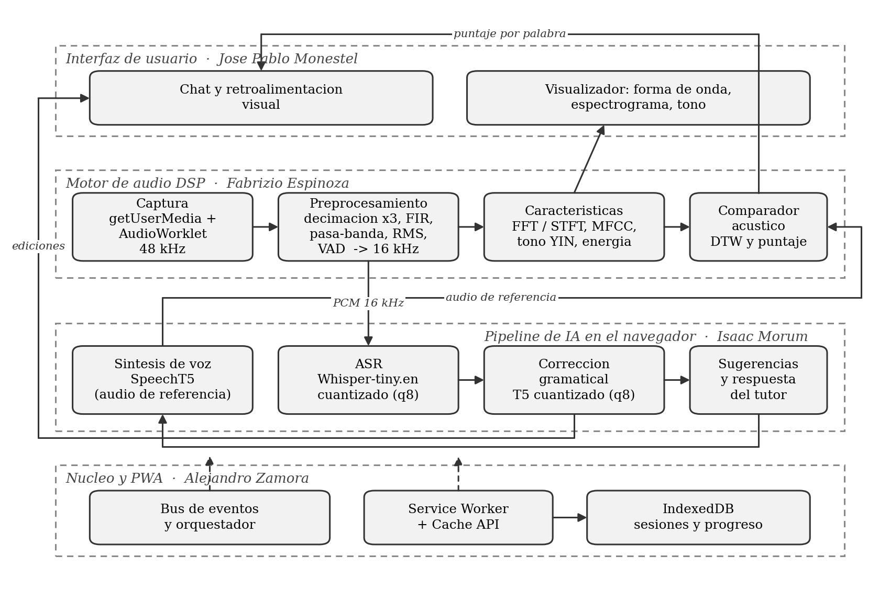

# My Personal English Teacher (MPET)

Aplicación web progresiva para practicar inglés conversacional. El usuario habla,
la aplicación transcribe lo que dijo, corrige su gramática, evalúa su pronunciación
mediante análisis de señales y le responde con voz.

**Todo el procesamiento ocurre dentro del navegador del usuario.** No hay servidor
de inferencia, no hay llamadas a APIs externas y el audio nunca sale del dispositivo.

> **Demo desplegada:** https://humanoidcat.github.io/mpet/
> Añadir `?mock=1` a la URL ejecuta el flujo completo con módulos simulados, sin
> micrófono ni descarga de modelos.

**Curso:** Señales y Sistemas · **Clase:** martes 1:00 pm
**Hitos:** Avance 1 → mar 28 jul · Avance 2 → mar 11 ago · Final → mar 8 sep

---

## Por qué en el navegador

Ejecutar la inferencia en el cliente no es una preferencia estética. Determina tres
propiedades del producto:

| Propiedad | Consecuencia |
|---|---|
| **Costo de operación cero** | Sin servidores de inferencia, sin cuotas por uso de API, sin límite de sesiones. |
| **Funciona sin conexión** | Tras la descarga inicial de los modelos, la aplicación opera sin red. Es lo que la vuelve utilizable donde la conectividad es intermitente o costosa. |
| **Privacidad por arquitectura** | La voz es un dato biométrico. Aquí no se transmite, no se almacena en terceros y no se usa para entrenar modelos ajenos. No depende de una política: depende de cómo está construida. |

El costo asumido es el peso de la descarga inicial (unos 411 MiB entre modelos y
runtime), del que solo **303 MiB** se pagan al arrancar: el sintetizador se carga
la primera vez que hace falta audio. La caché persistente evita repetirlo.

---

## Arquitectura



La decisión de diseño de mayor impacto fue definir, **antes de escribir código
funcional**, las interfaces entre módulos en TypeScript y congelarlas al cierre de
la Semana 1 (`src/shared/contracts.ts`). Cada módulo tiene además una
implementación simulada que respeta su contrato, en `mocks/`.

Esto produce tres efectos verificables:

1. **Desarrollo paralelo real.** Nadie espera el código de nadie. La interfaz se
   construyó contra un generador de señal sintética antes de que existiera la
   captura; el canal de IA se probó con audio pregrabado sin depender del DSP.
2. **Sustitución sin refactorización.** El orquestador recibe sus dependencias por
   inyección. Cambiar un mock por el módulo real es una línea de composición.
3. **Verificación aislada.** Cada módulo se prueba contra su contrato, de modo que
   la suite completa corre en integración continua sin micrófono, sin descargar
   modelos y sin intervención manual.

### Flujo de un turno de conversación

```
microfono 48 kHz
  -> FIR anti-aliasing (corte 7 200 Hz) + decimacion x3   -> 16 kHz
  -> pasa-banda 80-8 000 Hz + normalizacion RMS + VAD
  -> ventana de Hann + FFT radix-2                        -> visualizador
  -> ASR Whisper-tiny.en                                  -> transcripcion
  -> correccion gramatical T5                             -> ediciones
  -> sintesis de voz MMS-TTS (VITS)                       -> audio de referencia
  -> comparacion MFCC por DTW                             -> puntaje por palabra
```

---

## Conceptos de Señales y Sistemas aplicados

Cada concepto resuelve un problema concreto de la aplicación, y su correctitud se
verifica contra señales sintéticas de parámetros conocidos.

| Concepto | Dónde se aplica | Estado |
|---|---|---|
| Teorema de muestreo y aliasing | Decimación de 48 kHz a 16 kHz por factor entero 3 | Implementado |
| Filtro FIR de fase lineal | Anti-aliasing previo a la decimación, 127 coeficientes con ventana de Hann | Implementado |
| Filtro IIR biquad (Butterworth) | Pasa-banda de voz de 80 a 8 000 Hz | Implementado |
| Valor eficaz (RMS) | Normalización de nivel y detección de actividad de voz | Implementado |
| DFT y FFT radix-2 | Análisis espectral, implementación propia verificada contra la definición | Implementado |
| Ventanas y fuga espectral | Ventana de Hann con corrección de ganancia coherente | Implementado |
| STFT | Espectrograma en tiempo real | Implementado |
| Detección de periodicidad (YIN) | Frecuencia fundamental para entonación | Implementado |
| MFCC (banco mel + DCT) | Características robustas a la variabilidad entre hablantes | Implementado |
| Alineamiento temporal dinámico (DTW) | Comparación contra la pronunciación de referencia | Implementado |

---

## Mediciones verificadas

Obtenidas sobre señales sintéticas de frecuencia y amplitud conocidas, reproducibles
con `npm test`. El detalle está en [`docs/evidencias/`](docs/evidencias/).

| Etapa | Medición | Resultado |
|---|---|---|
| Remuestreo | Supresión del plegamiento espectral | 73.8 dB frente a decimación directa |
| Remuestreo | Retardo introducido por el filtro | 1.31 ms |
| Preprocesamiento | Atenuación en la frecuencia de corte | −3.01 dB |
| Detección de voz | Error de los límites del habla | 20 ms de adelanto, 28 ms de retraso |
| Detección de voz | Reducción de muestras al reconocedor | 58 % |
| Análisis espectral | Exactitud frente a la DFT por definición | Error relativo de 1.45 × 10⁻¹³ |
| Análisis espectral | Costo computacional | 1 145 veces más rápido que el cálculo directo |
| Reconocimiento de voz | Factor de tiempo real | 0.28 – 0.31 |
| Corrección gramatical | Latencia media | 320 ms |
| Frecuencia fundamental | Peor error en tonos puros (YIN) | 0.115 Hz, con criterio de 3 Hz |
| MFCC | Invariancia al volumen en un rango de ganancia de 1000x | 1.4 × 10⁻⁶ en los coeficientes c₁…c₁₂ |
| MFCC | Exactitud frente a librosa 0.11.0 | Error máximo de 0.009 %, con criterio de 5 % |

**Hallazgo documentado:** bajar la cuantización del corrector de 8 a 4 bits resultó
3.8 veces más lento **y** más pesado en caché. ONNX Runtime sobre WebAssembly no
tiene núcleos nativos de 4 bits y decuantiza en tiempo de ejecución. La decisión y
su evidencia están en [`docs/10-bitacora-decisiones.md`](docs/10-bitacora-decisiones.md).

---

## Estado actual

- **408 pruebas automatizadas** en verde, en 32 archivos, ninguna omitida.
- Cadena de audio completa e integrada: captura, remuestreo, preprocesamiento, detección de actividad de voz, STFT, frecuencia fundamental y MFCC.
- Reconocimiento de voz, corrección gramatical y síntesis de voz implementados sobre sus contratos.
- Comparador por alineamiento temporal dinámico y puntaje de pronunciación por palabra, conectados al turno de conversación.
- Persistencia de sesiones en IndexedDB.
- Interfaz con chat, control de micrófono con estados, forma de onda, espectrograma y contorno de tono en tiempo real.
- PWA instalable con service worker y caché de modelos.

**Pendiente, con lo más relevante primero:**

- El puntaje de pronunciación **no discrimina todavía con voz real**: la separación
  entre pares correctos e incorrectos es de 1.05 cuando el objetivo son 20 puntos.
  Con señales sintéticas alcanza 31. Es el riesgo R03 y está en investigación
  ([evidencia](docs/evidencias/s9/s9-t3-calibracion-voz-real.md)).
- La interfaz aún no muestra el puntaje por palabra, aunque el motor ya lo entrega.
- La respuesta del tutor y las sugerencias están cableadas pero devuelven valores
  neutros: falta el modelo que las genere.
- Falta verificar el arranque sin conexión. La descarga inicial baja de 411 a
  **303 MiB** con la carga bajo demanda del sintetizador, que se paga solo cuando
  se necesita audio.

El estado por requerimiento está en la
[matriz de trazabilidad](docs/07-matriz-trazabilidad.md), las decisiones y sus
mediciones en la [bitácora](docs/10-bitacora-decisiones.md), y el orden de trabajo
en el [plan vigente](docs/11-plan-post-avance-1.md).

---

## Tecnologías

| Capa | Elección | Por qué |
|---|---|---|
| Interfaz | React 18 + TypeScript | El tipado estático es lo que hace verificables los contratos entre módulos. |
| Compilación | Vite 5 | Arranque y recarga rápidos; `vite-plugin-pwa` genera el service worker. |
| Inferencia | transformers.js 3.8 + ONNX Runtime Web | Única vía madura para correr modelos de habla y lenguaje en el navegador sobre WebAssembly. |
| Reconocimiento de voz | Whisper-tiny.en cuantizado a 8 bits | Relación tamaño/precisión adecuada para 41 MB en caché con factor de tiempo real de 0.28. |
| Corrección gramatical | T5 cuantizado a 8 bits | Corrige a nivel de frase, no por reglas. |
| Procesamiento de señales | Implementación propia | El curso exige aplicar los conceptos, no consumir una biblioteca. La correctitud se verifica contra la definición matemática. |
| Estilos | Tailwind CSS 4 | Sin archivos de estilo separados por componente. |
| Pruebas | Vitest | Comparte configuración con Vite; el DSP se prueba fuera del navegador. |

Las versiones están fijadas a propósito: las mediciones de este repositorio
corresponden a esas versiones exactas.

---

## Estructura del repositorio

```
mpet/
├── src/
│   ├── core/      Bus de eventos, orquestador, service worker, almacenamiento
│   ├── audio/     Captura, dsp, caracteristicas, comparador
│   ├── ai/        ASR, gramatica, sugerencias, tts, cache de modelos
│   ├── ui/        Chat, visualizador, feedback, progreso
│   └── shared/    Contratos y constantes (cambios solo por PR shared-change)
├── mocks/         Implementaciones simuladas de cada contrato
├── tests/         Espejo de src/, por modulo
└── docs/          Planificacion, marco teorico, evidencias y entregas
```

---

## Arranque rápido

```bash
git clone https://github.com/HumanoidCat/mpet.git
cd mpet
npm install
npm run dev        # http://localhost:5173
```

| Comando | Qué hace |
|---|---|
| `npm run dev` | Servidor de desarrollo con recarga en caliente |
| `npm test` | Suite completa de pruebas |
| `npm run typecheck` | Verificación de tipos sin compilar |
| `npm run build` | Verificación de tipos y compilación de producción |
| `npm run preview` | Sirve la compilación de producción, para probar la PWA |

La primera sesión descarga los modelos y tarda; las siguientes cargan desde caché
en menos de un segundo. Para probar la interfaz sin esperar esa descarga, abrir
`http://localhost:5173/?mock=1`.

---

## Equipo y módulos

| Integrante | Módulo | Carpeta |
|---|---|---|
| Alejandro Zamora | Dirección del proyecto, núcleo, PWA e integración | `src/core/`, `src/shared/` |
| Fabrizio Espinoza | Procesamiento digital de señales | `src/audio/` |
| Isaac Morum | Inteligencia artificial (transformers.js) | `src/ai/` |
| José Pablo Monestel | Interfaz y visualización | `src/ui/` |

El historial de commits y pull requests documenta la contribución de cada integrante.

**Tu guía personal está en `guias/<tu-nombre>.md`. Léela antes de empezar.**

---

## Cómo trabajamos

1. Trabaja solo en tu carpeta (`src/<tu-modulo>/`), en tu rama `feat/<modulo>-<tarea>`.
2. `src/shared/` y `package.json` solo se tocan por pull request etiquetado
   `shared-change`, aprobado por el líder técnico y por el responsable del módulo
   afectado.
3. Si el módulo de otro no existe todavía, desarrolla contra su mock en `mocks/`.
4. Pull request a `dev` con la verificación en verde y una revisión. Nunca push
   directo a `main` ni a `dev`.
5. Push diario aunque el trabajo esté incompleto, en tu rama.
6. El orden de trabajo lo fija [`docs/11-plan-post-avance-1.md`](docs/11-plan-post-avance-1.md),
   no el número de semana: si una tarea no está bloqueada, se puede empezar.

### Integración continua

Cada pull request y cada push a `main` o `dev` dispara el pipeline de
[`.github/workflows/ci.yml`](.github/workflows/ci.yml), que ejecuta verificación de
tipos, la suite de pruebas y la compilación de producción. Los push a `main`
despliegan la demo a GitHub Pages automáticamente, así que la versión publicada
siempre corresponde al último estado aprobado.

---

## Documentación

Toda la planificación y la evidencia está en [`docs/`](docs/README.md):

| Documento | Contenido |
|---|---|
| [`00-vision-alcance.md`](docs/00-vision-alcance.md) | Visión, alcance y criterios de éxito |
| [`01-arquitectura.md`](docs/01-arquitectura.md) | Arquitectura detallada y contratos |
| [`02-product-backlog.md`](docs/02-product-backlog.md) | Historias de usuario y estructura de desglose del trabajo |
| [`04-plan-semanal.md`](docs/04-plan-semanal.md) | Plan de las diez semanas, tarea por tarea |
| [`05-roadmap.md`](docs/05-roadmap.md) | Diagrama de Gantt y ruta crítica |
| [`06-matriz-riesgos.md`](docs/06-matriz-riesgos.md) | Riesgos, probabilidad, impacto y mitigación |
| [`07-matriz-trazabilidad.md`](docs/07-matriz-trazabilidad.md) | Requerimientos y su estado de verificación |
| [`08-equipo-git.md`](docs/08-equipo-git.md) | Reparto de módulos y flujo de trabajo con Git |
| [`09-marco-teorico.md`](docs/09-marco-teorico.md) | Marco teórico con las ecuaciones del curso |
| [`10-bitacora-decisiones.md`](docs/10-bitacora-decisiones.md) | Registro de decisiones técnicas y su justificación |
| [`11-plan-post-avance-1.md`](docs/11-plan-post-avance-1.md) | Plan de trabajo vigente: orden de tareas por ruta crítica |
| [`evidencias/`](docs/evidencias/) | Mediciones por tarea, reproducibles con la suite de pruebas |

---

## Nota académica

Proyecto del curso de Señales y Sistemas. Los modelos de terceros conservan sus
licencias de origen; el código propio es de uso académico.
