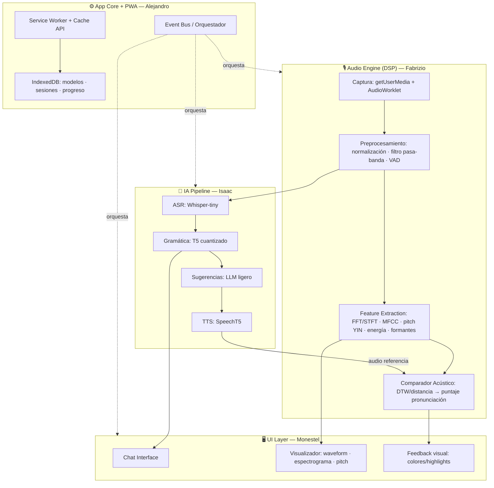

# Arquitectura de Software

## 1. Principio rector

**Módulos desacoplados por contrato.** Cada estudiante es dueño de un módulo con una interfaz pública definida en la Semana 1. Los módulos se comunican mediante un *event bus* y tipos compartidos (`src/shared/`). Cada módulo incluye un **mock** de sus dependencias, así nadie se bloquea esperando el trabajo de otro.

## 2. Diagrama de bloques (macro)



## 3. Flujo de datos principal (conversación)

1. Usuario presiona micrófono → `AudioEngine` captura a 16 kHz mono (requisito de Whisper; se documenta Nyquist: voz ≤ 8 kHz).
2. Preprocesamiento: normalización de amplitud, filtro pasa-banda 80–8000 Hz, detección de actividad de voz (VAD por energía).
3. En paralelo: (a) features → visualizador en tiempo real; (b) buffer PCM → ASR.
4. ASR emite transcripción → corrección gramatical → sugerencias → respuesta.
5. TTS sintetiza la respuesta y la frase corregida; ese audio de referencia alimenta al comparador acústico.
6. Comparador: MFCC+pitch del usuario vs. referencia, alineados con DTW → puntaje global y por palabra → feedback visual.

## 4. Estructura del repositorio

```
mpet/
├── public/               # manifest.json, iconos PWA
├── src/
│   ├── core/             # Alejandro: event bus, orquestador, service worker, storage
│   ├── audio/            # Fabrizio: captura, dsp/, features/, comparador/
│   ├── ai/               # Isaac: asr/, grammar/, suggestions/, tts/, model-cache/
│   ├── ui/               # Monestel: chat/, visualizer/, feedback/
│   └── shared/           # tipos, contratos, constantes (todos; cambios por PR)
├── tests/                # espejo de src/, por módulo
├── docs/                 # esta planificación + documentos de entregas
└── mocks/                # respuestas simuladas por módulo (clave del desacople)
```

## 5. Contratos entre módulos (definidos Semana 1, congelados)

```ts
// shared/contracts.ts — resumen
interface AudioEngine {
  start(): Promise<void>; stop(): Float32Array;            // PCM 16 kHz
  onFrame(cb: (f: AudioFrame) => void): void;              // para visualizador
}
interface AudioFrame { pcm: Float32Array; fft: Float32Array; pitchHz: number|null; energy: number; mfcc: number[]; }
interface AIPipeline {
  transcribe(pcm: Float32Array): Promise<string>;
  correctGrammar(text: string): Promise<{corrected: string; edits: Edit[]}>;
  suggest(text: string): Promise<string[]>;
  speak(text: string): Promise<Float32Array>;              // audio referencia
}
interface PronunciationScorer {
  score(user: AudioFrame[], ref: AudioFrame[], words: WordAlign[]): PronunciationResult;
}
```

Mientras un módulo real no exista, el resto consume su **mock** (`mocks/`): p. ej. la UI se desarrolla con transcripciones y puntajes falsos desde el día 1.

## 6. Decisiones técnicas justificadas

| Decisión | Alternativa descartada | Justificación |
|---|---|---|
| React 18 + Vite | Vanilla JS | Aislamiento por componentes = 4 personas sin pisarse; Vite tiene plugin PWA oficial; estándar de industria fácil de defender. |
| transformers.js (@huggingface/transformers) | Web Speech API como solución final | El documento **exige** modelos HF client-side; Web Speech usa servidores de Google (no offline). Se usa Web Speech solo como fallback de prototipo (recomendación del profesor). |
| Whisper-tiny (Xenova/whisper-tiny.en) | whisper-base/small | ~40 MB cuantizado, latencia aceptable en laptop promedio; base queda como upgrade si sobra rendimiento. |
| MFCC/pitch/FFT **implementados a mano** (con Meyda solo como verificación) | usar librería directamente | Es un curso de Señales y Sistemas: implementar la STFT, mel filterbank y YIN demuestra los conceptos; comparar contra Meyda/librosa sirve de prueba de correctitud (excelente evidencia). |
| YIN para pitch | autocorrelación simple | YIN es robusto a octava errors y es citable (paper de Cheveigné 2002); la autocorrelación se implementa primero como paso didáctico. |
| DTW para alinear features usuario/referencia | comparación frame a frame | Las locuciones difieren en duración; DTW es el método clásico y explicable. |
| AudioWorklet + Web Worker para DSP/inferencia | procesar en main thread | Mantiene UI a 60 fps; requisito de visualización en tiempo real. |
| Cache API para modelos + IndexedDB para sesiones | solo IndexedDB | transformers.js cachea automáticamente en Cache API; no reinventar. |
| Canvas 2D para visualizaciones | WebGL/three.js | Suficiente para waveform/espectrograma a 30 fps; menos complejidad = regla "sin tecnologías innecesarias". |
| Sugerencias con Xenova/LaMini-Flan-T5-248M (o similar T5 pequeño) | Phi-2/SmolLM | Phi-2 (~1.5 GB) es inviable en browser promedio; un T5 chico cumple el requisito con demo fluida. Se valida en Semana 5 con pruebas de tamaño/latencia. |

## 7. Tecnologías

React 18, Vite + vite-plugin-pwa (Workbox), TypeScript, @huggingface/transformers (transformers.js v3, ONNX Runtime Web/WebGPU con fallback WASM), Web Audio API (AudioWorklet), Canvas 2D, Vitest (pruebas), GitHub + GitHub Actions (CI), GitHub Pages (deploy demo), Draw.io/Mermaid (diagramas), KaTeX (ecuaciones en documentos).
