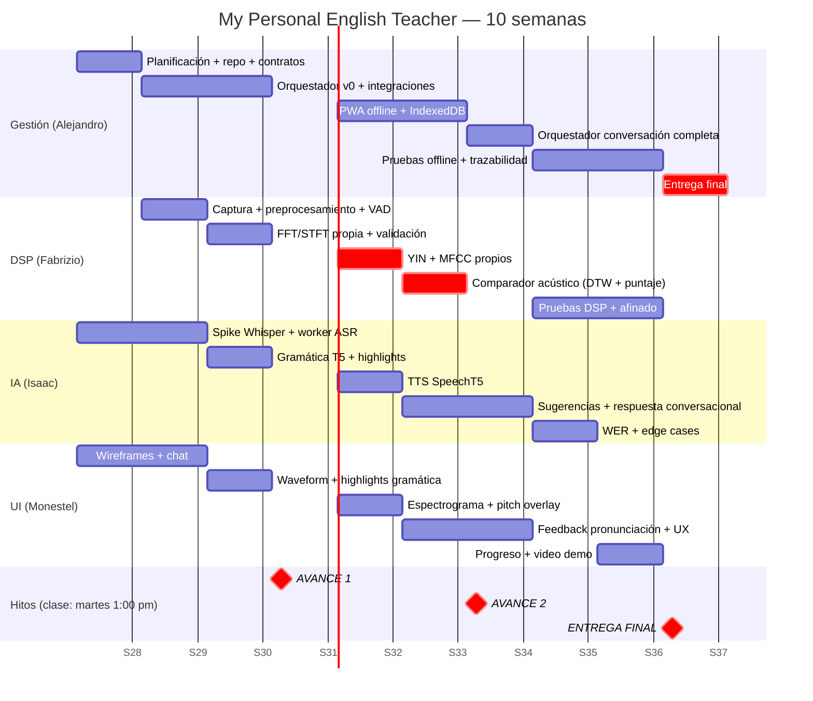

# Roadmap Visual



## Calendario de clases (martes 1:00 pm — se muestra avance cada semana)

| Semana | Martes | Qué se muestra en clase |
|---|---|---|
| 1 | 14 jul | Planificación, arquitectura, repo creado |
| 2 | 21 jul | Captura de audio + primera transcripción |
| 3 | 28 jul | Waveform en vivo + corrección gramatical |
| 4 | **4 ago** | 🎯 **AVANCE 1** (documento + presentación + demo MVP) |
| 5 | 11 ago | Espectrograma, pitch YIN, MFCC, TTS |
| 6 | 18 ago | Puntaje de pronunciación + app instalable |
| 7 | **25 ago** | 🎯 **AVANCE 2** (conversación completa + documento) |
| 8 | 1 sep | Reporte de pruebas y métricas (WER, latencia) |
| 9 | 8 sep | Pantalla de progreso + borrador documento final |
| 10 | **15 sep** | 🎯 **ENTREGA FINAL** |

**Regla de cadencia:** cada lunes por la noche el `dev` queda estable y ensayado para mostrar en la clase del martes. Si el profesor pide ajustes, se incorporan al backlog en la retro del mismo martes.

## Vista simplificada

```
Semana:   1      2      3      4      5      6      7      8      9      10
         ┌──────┬──────┬──────┬──────┬──────┬──────┬──────┬──────┬──────┬──────┐
Fase:    │ PLAN │  CONSTRUCCIÓN MVP  │ SEÑALES AVANZADAS  │ CALIDAD Y CIERRE   │
         └──────┴──────┴──────┴──────┴──────┴──────┴──────┴──────┴──────┴──────┘
Hitos:                        ▲AVANCE 1            ▲AVANCE 2             ▲FINAL
MVP:     ████████████████████████
V1:                                 █████████████████████
Final:                                                    ██████████████████████
```

**Ruta crítica:** Captura audio (S2) → FFT/MFCC (S3–S5) → YIN (S5) → Comparador DTW (S6) → Integración conversación (S7) → Pruebas (S8). El módulo DSP de Fabrizio está en la ruta crítica; Alejandro monitorea su avance dos veces por semana.
