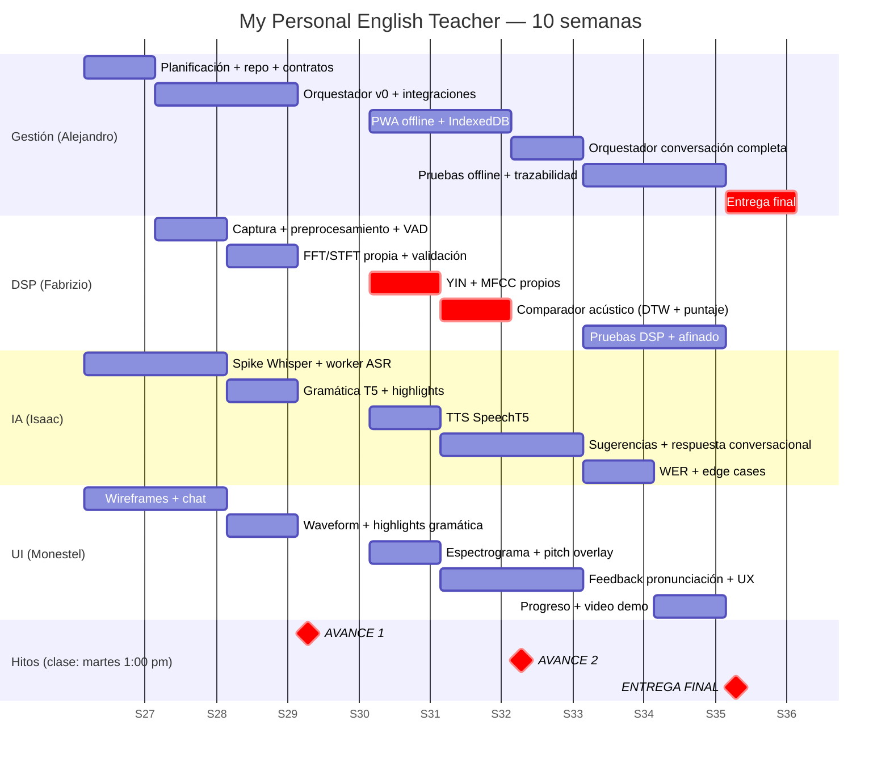

# Roadmap Visual


```mermaid
gantt
    title My Personal English Teacher — 10 semanas
    dateFormat YYYY-MM-DD
    axisFormat S%W

    section Gestión (Alejandro)
    Planificación + repo + contratos       :done_a1, 2026-07-06, 7d
    Orquestador v0 + integraciones          :a2, 2026-07-13, 14d
    PWA offline + IndexedDB                 :a3, 2026-08-03, 14d
    Orquestador conversación completa       :a4, 2026-08-17, 7d
    Pruebas offline + trazabilidad          :a5, 2026-08-24, 14d
    Entrega final                           :crit, a6, 2026-09-07, 7d

    section DSP (Fabrizio)
    Captura + preprocesamiento + VAD        :f1, 2026-07-13, 7d
    FFT/STFT propia + validación            :f2, 2026-07-20, 7d
    YIN + MFCC propios                      :crit, f3, 2026-08-03, 7d
    Comparador acústico (DTW + puntaje)     :crit, f4, 2026-08-10, 7d
    Pruebas DSP + afinado                   :f5, 2026-08-24, 14d

    section IA (Isaac)
    Spike Whisper + worker ASR              :i1, 2026-07-06, 14d
    Gramática T5 + highlights               :i2, 2026-07-20, 7d
    TTS SpeechT5                            :i3, 2026-08-03, 7d
    Sugerencias + respuesta conversacional  :i4, 2026-08-10, 14d
    WER + edge cases                        :i5, 2026-08-24, 7d

    section UI (Monestel)
    Wireframes + chat                       :m1, 2026-07-06, 14d
    Waveform + highlights gramática         :m2, 2026-07-20, 7d
    Espectrograma + pitch overlay           :m3, 2026-08-03, 7d
    Feedback pronunciación + UX             :m4, 2026-08-10, 14d
    Progreso + video demo                   :m5, 2026-08-31, 7d

    section Hitos (clase: martes 1:00 pm)
    AVANCE 1                                :milestone, crit, 2026-07-28, 0d
    AVANCE 2                                :milestone, crit, 2026-08-18, 0d
    ENTREGA FINAL                           :milestone, crit, 2026-09-08, 0d
```

## Calendario de clases (martes 1:00 pm — se muestra avance cada semana)

| Semana | Martes | Qué se muestra en clase |
|---|---|---|
| 1 | 7 jul | Planificación, arquitectura, repo creado |
| 2 | 14 jul | Captura de audio + primera transcripción |
| 3 | 21 jul | Waveform en vivo + corrección gramatical |
| 4 | **28 jul** | 🎯 **AVANCE 1** (documento + presentación + demo MVP) |
| 5 | 4 ago | Espectrograma, pitch YIN, MFCC, TTS |
| 6 | 11 ago | Puntaje de pronunciación + app instalable |
| 7 | **18 ago** | 🎯 **AVANCE 2** (conversación completa + documento) |
| 8 | 25 ago | Reporte de pruebas y métricas (WER, latencia) |
| 9 | 1 sep | Pantalla de progreso + borrador documento final |
| 10 | **8 sep** | 🎯 **ENTREGA FINAL** |

**Regla de cadencia:** cada lunes por la noche el `dev` queda estable y ensayado para mostrar en la clase del martes. Si el profesor pide ajustes, se incorporan al backlog en la retro del mismo martes.

## Vista simplificada

```
Semana:   1      2      3      4      5      6      7      8      9      10
         ┌──────┬──────┬──────┬──────┬──────┬──────┬──────┬──────┬──────┬──────┐
Fase:    │ PLAN │  CONSTRUCCIÓN MVP  │ SEÑALES AVANZADAS  │ CALIDAD Y CIERRE   │
         └──────┴──────┴──────┴──────┴──────┴──────┴──────┴──────┴──────┴──────┘
Hitos:                        ▲AVANCE 1            ▲AVANCE 2             ▲FINAL
MVP:     ████████████████████████
V1:                                 █████████████████████
Final:                                                    ██████████████████████
```

**Ruta crítica:** Captura audio (S2) → FFT/MFCC (S3–S5) → YIN (S5) → Comparador DTW (S6) → Integración conversación (S7) → Pruebas (S8). El módulo DSP de Fabrizio está en la ruta crítica; Alejandro monitorea su avance dos veces por semana.
