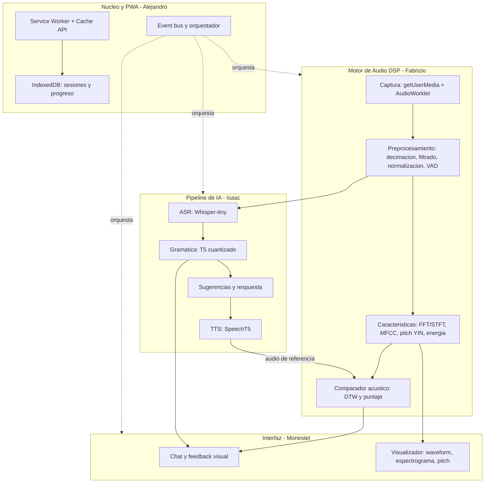

# My Personal English Teacher (MPET)
## Avance 1 — Documento Técnico

**Curso:** Señales y Sistemas
**Equipo:** Alejandro Zamora (Project Manager, Núcleo e Integración) · Fabrizio Espinoza (Procesamiento Digital de Señales) · Isaac Morum (Inteligencia Artificial) · José Pablo Monestel (Interfaz y Visualización)
**Repositorio:** https://github.com/HumanoidCat/mpet
**Demo desplegada:** https://humanoidcat.github.io/mpet/
**Fecha de entrega:** Semana 4

---

## 1. Descripción del problema

Aprender inglés conversacional es, para un hispanohablante, un problema distinto al
de aprender su gramática o su vocabulario. La dificultad central no es de
conocimiento sino de **producción oral**: el estudiante sabe la regla, pero no
consigue pronunciar de forma inteligible ni sostener una conversación con fluidez.

Este problema tiene tres causas identificables:

**Barrera fonética.** El inventario fonológico del español tiene cinco vocales; el
del inglés supera las once, además de contrastes consonánticos inexistentes en
español. Pares mínimos como *ship*/*sheep* o *bad*/*bed* se colapsan en un mismo
sonido para el oído no entrenado. El estudiante no puede corregir lo que no
distingue, y sin retroalimentación externa el error se fosiliza.

**Falta de práctica conversacional accesible.** La práctica oral efectiva exige un
interlocutor que corrija en el momento. Las alternativas reales —tutorías privadas,
academias, intercambios— son costosas, dependen de horarios y, sobre todo,
requieren conexión estable. En zonas con conectividad limitada o para estudiantes
con restricciones económicas, esa práctica simplemente no ocurre.

**Retroalimentación tardía o inexistente.** Las aplicaciones masivas de idiomas
evalúan mayoritariamente comprensión y gramática escrita. Cuando incorporan
reconocimiento de voz, devuelven un veredicto binario ("correcto" / "inténtalo de
nuevo") sin explicar *qué* falló: si la vocal fue muy corta, si la entonación cayó
donde debía subir, si el problema fue una consonante final omitida.

### El problema desde la perspectiva de Señales y Sistemas

Evaluar pronunciación automáticamente es, en el fondo, un problema de análisis de
señales. La voz es una señal continua que debe muestrearse respetando el criterio
de Nyquist, filtrarse para eliminar ruido y componentes fuera de la banda de
interés, y transformarse al dominio de la frecuencia para extraer las
características que efectivamente distinguen un fonema de otro. Las dificultades
técnicas son concretas y medibles:

- **Ruido ambiental y variabilidad del canal.** El micrófono captura ruido de fondo,
  reverberación de la sala y distorsiones propias del dispositivo. Sin
  preprocesamiento, ese ruido contamina toda medición posterior.
- **Variabilidad acústica entre hablantes.** La misma palabra pronunciada por dos
  personas produce señales muy distintas en amplitud, duración y frecuencia
  fundamental. La comparación no puede ser muestra a muestra: requiere
  características robustas a esa variabilidad y alineamiento temporal.
- **Restricción de tiempo real.** El análisis debe ocurrir mientras el usuario habla,
  sin bloquear la interfaz, y con retroalimentación en menos de dos segundos para
  que la corrección resulte útil pedagógicamente.

El proyecto aborda estas dificultades aplicando muestreo y decimación con filtro
anti-aliasing, filtrado en banda de voz, transformada de Fourier de tiempo corto,
extracción de coeficientes cepstrales en escala mel (MFCC), detección de frecuencia
fundamental y comparación mediante alineamiento temporal dinámico.

---

## 2. Justificación

**Valor educativo.** La retroalimentación inmediata y específica es el factor que
más acelera la adquisición de una segunda lengua. Una herramienta que señale *qué
palabra* se pronunció mal, con qué grado de desviación y frente a qué referencia,
ataca el problema de la fosilización de errores que las aplicaciones existentes
dejan sin resolver.

**Accesibilidad y costo.** Al ejecutarse íntegramente en el navegador del usuario,
la aplicación tiene costo de operación cero: no hay servidores de inferencia, no
hay cuotas por uso de API, no hay límite de sesiones. Tras la descarga inicial de
los modelos funciona sin conexión, lo que la vuelve utilizable en contextos de
conectividad intermitente o costosa. Esto no es una decisión estética sino la que
determina si la herramienta es realmente accesible para quien más la necesita.

**Privacidad.** La voz es un dato biométrico. En una arquitectura cliente el audio
nunca sale del dispositivo: no se transmite, no se almacena en terceros, no se
utiliza para entrenar modelos ajenos. La privacidad no depende de una política sino
de la arquitectura.

**Pertinencia con el curso.** El proyecto exige aplicar de forma no decorativa los
contenidos de Señales y Sistemas: teorema de muestreo, aliasing, filtrado digital,
DFT y espectrogramas, extracción de características, detección de periodicidad y
comparación de señales. Cada uno de estos conceptos resuelve un problema concreto
dentro de la aplicación, y su correctitud es verificable mediante pruebas contra
señales sintéticas de parámetros conocidos y contra bibliotecas de referencia.

**Pertinencia con la industria de TI.** La combinación de Progressive Web Apps con
inferencia en el borde (*edge AI*) es una tendencia consolidada: reduce costos de
infraestructura, elimina latencia de red y resuelve requisitos de privacidad y
cumplimiento normativo. Trabajar con transformers.js, ONNX Runtime Web y
cuantización de modelos corresponde a competencias vigentes en el mercado.

---

## 3. Arquitectura propuesta a nivel macro

### 3.1 Principio rector: desacoplamiento por contratos

La decisión arquitectónica de mayor impacto fue definir, antes de escribir código
funcional, un conjunto de **interfaces (contratos) en TypeScript** que delimitan la
frontera entre módulos, y congelarlas al cierre de la Semana 1
(`src/shared/contracts.ts`). Cada módulo posee además una **implementación simulada**
(*mock*) que respeta su contrato.

Esta decisión produjo tres beneficios verificables durante el desarrollo:

1. **Trabajo verdaderamente paralelo.** Cada integrante desarrolla contra los mocks
   de los demás; nadie espera código ajeno. La interfaz se desarrolló contra un
   generador de señal sintética antes de que existiera la captura real.
2. **Sustitución sin refactorización.** El orquestador recibe sus dependencias por
   inyección: reemplazar un mock por el módulo real es cambiar una línea de
   composición, sin tocar lógica.
3. **Verificación aislada por módulo.** Cada módulo se prueba contra su contrato
   sin depender de los demás, de modo que la suite completa corre en integración
   continua sin micrófono, sin descarga de modelos y sin intervención manual.

### 3.2 Diagrama de bloques



### 3.3 Flujo de datos de un turno de conversación

1. El usuario activa el micrófono. La captura entrega audio a 48 kHz (rate impuesto
   por el hardware, medido en el spike S1-T6) y se decima por factor entero 3 hasta
   16 kHz, previo filtro anti-aliasing con corte en 7 200 Hz.
2. Se aplica normalización RMS, filtrado pasa-banda en 80–8 000 Hz y detección de
   actividad de voz por umbral de energía.
3. En paralelo: las características alimentan el visualizador en tiempo real, y el
   bloque PCM completo alimenta el reconocedor de voz.
4. El ASR produce la transcripción con marcas temporales por palabra; el corrector
   gramatical devuelve el texto corregido y la lista de ediciones; el generador
   produce la respuesta del tutor y las sugerencias.
5. El sintetizador de voz pronuncia la frase correcta y entrega esa señal como
   **referencia acústica** al comparador.
6. El comparador alinea por DTW las secuencias de MFCC del usuario y de la
   referencia, y produce un puntaje global y por palabra que la interfaz traduce a
   retroalimentación visual.

### 3.4 Organización del repositorio

```
mpet/
├── src/
│   ├── core/      Alejandro: event bus, orquestador, service worker, almacenamiento
│   ├── audio/     Fabrizio: captura, dsp, caracteristicas, comparador
│   ├── ai/        Isaac: asr, gramatica, sugerencias, tts, cache de modelos
│   ├── ui/        Monestel: chat, visualizador, feedback, progreso
│   └── shared/    Contratos y constantes (cambios solo por PR shared-change)
├── mocks/         Implementaciones simuladas de cada contrato
├── tests/         Espejo de src/, por modulo
└── docs/          Planificacion, marco teorico, evidencias y entregas
```

### 3.5 Decisiones técnicas y su justificación

| Decisión | Alternativa descartada | Justificación |
|---|---|---|
| React 18 + Vite + TypeScript | JavaScript sin framework | Aislamiento por componentes para trabajo paralelo; el tipado estático hace que los contratos entre módulos sean verificables por el compilador, no solo por convención |
| transformers.js (Hugging Face) | Web Speech API como solución final | Web Speech delega el reconocimiento en servidores del navegador: incumple el requisito de ejecución client-side y de operación offline. Se conserva únicamente como plan de contingencia documentado |
| Whisper-tiny.en cuantizado | whisper-base / small | Medido en spike: 41 MB y RTF 0.3. Las variantes mayores comprometen la latencia objetivo sin necesidad demostrada |
| Implementación propia de FFT, MFCC y detección de pitch | Usar directamente una biblioteca DSP | Es el contenido evaluable del curso. Las bibliotecas de referencia (Meyda, librosa) se emplean como patrón de validación numérica, no como implementación |
| Decimación entera con filtro anti-aliasing explícito | Delegar el remuestreo al navegador | El remuestreador del navegador no documenta su filtro; además Safari ignora históricamente el parámetro de sample rate. La decimación explícita es portable y es evidencia directa del curso |
| AudioWorklet y Web Workers | Procesamiento en el hilo principal | Mantiene la interfaz fluida durante análisis e inferencia, requisito de la visualización en tiempo real |
| Canvas 2D para visualización | WebGL o bibliotecas de gráficos | Suficiente para el objetivo de 30 fps; evita dependencias innecesarias |
| Inyección de dependencias en el orquestador | Instanciación directa de módulos | Permite sustituir mocks por módulos reales sin modificar la lógica de coordinación |

---

## 4. Objetivos

### 4.1 Objetivo general

Desarrollar una Progressive Web App de funcionamiento offline para la práctica de
inglés conversacional, que integre procesamiento digital de señales de voz e
inferencia de modelos de inteligencia artificial ejecutados íntegramente en el
navegador.

### 4.2 Objetivos específicos

1. Capturar y acondicionar la señal de voz en tiempo real: decimación con filtro
   anti-aliasing a 16 kHz, normalización RMS, filtrado pasa-banda 80–8 000 Hz y
   detección de actividad de voz.
2. Alcanzar una tasa de error de palabra (WER) menor o igual al 25 % con
   `whisper-tiny.en` sobre un conjunto de 50 frases de práctica.
3. Mantener la latencia de la etapa de reconocimiento por debajo de 2 segundos para
   locuciones de hasta 10 palabras.
4. Implementar la extracción de 13 coeficientes MFCC y la detección de frecuencia
   fundamental mediante el algoritmo YIN, validando ambas contra bibliotecas de
   referencia con un error inferior al 5 %.
5. Calcular un puntaje de pronunciación por palabra a partir de la distancia entre
   secuencias de características del usuario y de una referencia sintetizada,
   alineadas mediante DTW.
6. Renderizar forma de onda y espectrograma en tiempo real a 30 fps o más, sin
   bloquear el hilo principal de la interfaz.
7. Garantizar operación offline completa tras la carga inicial de los modelos,
   verificable mediante la desconexión de red del navegador.
8. Alcanzar una precisión igual o superior al 80 % en la corrección de un conjunto
   de 50 frases con errores gramaticales típicos de hispanohablantes.

### 4.3 Objetivos de aprendizaje

Demostrar la aplicación correcta de: teorema de muestreo de Nyquist–Shannon y
prevención de aliasing; diseño y efecto de filtros digitales; transformada discreta
de Fourier, ventaneo y transformada de tiempo corto; representación cepstral en
escala mel; algoritmos de detección de periodicidad; y comparación de señales
mediante alineamiento temporal no lineal.

---

## 5. Marco teórico

El desarrollo completo del marco teórico, con ecuaciones y hallazgos medidos, se
encuentra en `docs/09-marco-teorico.md` del repositorio. Esta sección resume los
fundamentos aplicados hasta el Avance 1.

### 5.1 Muestreo y teorema de Nyquist

Una señal continua $x(t)$ se convierte en la secuencia discreta
$x[n] = x(nT_s)$, con frecuencia de muestreo $f_s = 1/T_s$. El teorema de
muestreo establece que la reconstrucción sin pérdida requiere

$$f_s > 2 f_{max}$$

siendo la frecuencia de Nyquist $f_N = f_s/2$. A 16 kHz, $f_N = 8\,000$ Hz, techo
suficiente para la voz: la frecuencia fundamental humana se sitúa entre 85 y 255 Hz
y los formantes relevantes para distinguir fonemas se concentran por debajo de
4 kHz.

**Hallazgo medido (spike S1-T6).** El micrófono del equipo entrega exclusivamente
48 000 Hz —`getCapabilities()` devuelve un rango degenerado 48 000–48 000, es decir
un valor único, no negociable—. Como 48 000 / 16 000 = 3 es entero, corresponde una
**decimación exacta**: filtrar pasa-bajos con corte en 7 200 Hz (90 % del Nyquist
destino, con margen para la caída no ideal del filtro) y conservar una de cada tres
muestras. Omitir ese filtro plegaría todo el contenido entre 8 y 24 kHz sobre la
banda útil (aliasing), corrompiendo las mediciones posteriores.

**Filtro anti-aliasing implementado (S2-T1).** La respuesta ideal de un
pasa-bajos es una función sinc de duración infinita. El filtro se obtiene
truncándola a 127 coeficientes y multiplicándola por una ventana de Hann: el
truncamiento abrupto —equivalente a una ventana rectangular— produciría el
fenómeno de Gibbs, con rizado en la banda de paso y fugas en la de rechazo. Se
adoptó un número impar de coeficientes para que el filtro resulte de fase lineal
con retardo de grupo entero, condición necesaria porque la señal resultante
alimenta al comparador acústico, donde una distorsión de fase desalinearía la
forma de onda. Los coeficientes se normalizan a ganancia unitaria en continua,
de modo que el filtrado no altere el nivel de la señal.

Respuesta en frecuencia medida:

| Frecuencia | Ganancia | Atenuación | Zona |
|---:|---:|---:|---|
| 300 Hz | 1.00003 | 0.0 dB | Banda de paso (fundamental) |
| 3 400 Hz | 1.00006 | 0.0 dB | Banda de paso (formantes) |
| 6 000 Hz | 0.99833 | −0.0 dB | Banda de paso |
| 7 200 Hz | 0.50003 | −6.0 dB | Frecuencia de corte |
| **8 000 Hz** | 0.00589 | **−44.6 dB** | Nyquist destino |
| 9 000 Hz | 0.00027 | −71.4 dB | Banda de rechazo |
| 12 000 Hz | 0.00002 | −95.4 dB | Banda de rechazo |

La banda de paso resulta plana hasta 6 kHz, con error inferior al 0.2 %, y la
atenuación en el Nyquist destino alcanza 44.6 dB.

**Verificación experimental del plegamiento.** Un tono de 9 000 Hz muestreado a
48 kHz excede el Nyquist destino y, al decimar, se pliega sobre

$$f_{alias} = \left| ((9\,000 + 8\,000) \bmod 16\,000) - 8\,000 \right| = 7\,000 \text{ Hz}$$

es decir, aparece como una fricativa de 7 kHz que nunca fue pronunciada. La
medición de esa componente en la salida contrasta ambos procedimientos:

| Procedimiento | Amplitud en 7 kHz | Nivel |
|---|---:|---:|
| Decimación directa, sin filtrar | 1.00000 | 0.0 dB |
| **Filtrado previo y decimación** | **0.00021** | **−73.8 dB** |

La mejora es de **73.8 dB**. El orden de las operaciones no admite inversión:
una vez plegada, la componente de 9 kHz es matemáticamente indistinguible de una
de 7 kHz legítima, y ningún filtrado posterior puede separarlas.

**Compromiso asumido.** La banda de transición del filtro ocupa de 6.5 a 8 kHz,
intervalo donde se sitúan las fricativas más agudas. Es una consecuencia
inevitable de trabajar con un filtro real de longitud finita: con 127
coeficientes la transición no puede ser más angosta. Se aceptó porque la energía
dominante de esas fricativas se encuentra por debajo de 7 kHz. De resultar el
evaluador de pronunciación sensible a esta atenuación, la variable a modificar es
el número de coeficientes, no la frecuencia de corte.

### 5.2 Transformada discreta de Fourier

El análisis espectral se apoya en la DFT:

$$X[k] = \sum_{n=0}^{N-1} x[n] \, e^{-j 2\pi k n / N}$$

calculada mediante FFT de base 2. Para señales no estacionarias como la voz se
emplea la transformada de tiempo corto (STFT), que aplica la DFT sobre ventanas
solapadas, previa multiplicación por una ventana de Hann para atenuar la fuga
espectral introducida por el truncamiento.

**Implementación y validación (S3-T1).** La transformada se implementó como una
FFT de base 2 según el algoritmo de Cooley–Tukey, en su forma iterativa:
permutación de las muestras por inversión de bits seguida de $\log_2 N$ etapas de
mariposas. Los factores de giro se precalculan en una tabla en lugar de
acumularse por multiplicación sucesiva dentro del bucle, decisión que evita la
deriva del error a lo largo de las etapas.

La verificación se realizó **contra referencias analíticas y no contra
bibliotecas de terceros**. El criterio metodológico adoptado es que contrastar
una implementación con otra biblioteca demuestra únicamente que ambas coinciden;
contrastarla con resultados deducibles de la teoría demuestra que es correcta.
La primera referencia es la DFT calculada directamente a partir de su
definición, implementada dentro de la propia prueba: una biblioteca puede
contener errores, la definición matemática no.

| N | Error absoluto máximo | Error relativo |
|---:|---:|---:|
| 128 | 4.63 × 10⁻¹³ | 2.61 × 10⁻¹⁴ |
| **512** (tamaño de producción) | **4.90 × 10⁻¹²** | **1.45 × 10⁻¹³** |
| 1024 | 1.59 × 10⁻¹¹ | 3.26 × 10⁻¹³ |
| 2048 | 5.66 × 10⁻¹¹ | 7.00 × 10⁻¹³ |

El error corresponde exclusivamente al redondeo de punto flotante —la precisión
de un valor de doble precisión es del orden de 2 × 10⁻¹⁶— y crece con lentitud al
aumentar N. Se verificaron adicionalmente las propiedades que caracterizan a la
transformada con independencia de la implementación: linealidad, conservación de
la energía (teorema de Parseval), reversibilidad mediante la transformada inversa
y simetría conjugada de las señales reales.

**Señales con solución analítica cerrada.** El tercer nivel de verificación
emplea entradas cuya transformada se deduce en papel, de modo que el resultado
esperado no proviene de ninguna implementación:

| Señal | Resultado teórico | Verificación |
|---|---|---|
| $\sin(2\pi k_0 n/N)$ centrada en bin | $\|X[k_0]\| = N/2$, nulo en el resto | Exacta a 10⁻⁶; resto por debajo de 10⁻⁹ |
| $\delta[n]$ | $X[k] = 1$ para todo $k$: espectro plano | Exacta a 10⁻⁹ |
| $\delta[n - n_0]$ | Módulo unitario y fase lineal $e^{-j2\pi k n_0/N}$ | Exacta a 10⁻⁹ |
| $x[n] = c$ | $X[0] = Nc$, nulo en el resto | Exacta a 10⁻⁶ |

El par formado por el impulso y la señal constante ilustra la dualidad
tiempo–frecuencia: lo que aparece concentrado en un dominio se distribuye
uniformemente en el otro. La verificación por separado de las partes real e
imaginaria de un coseno y un seno confirma además la convención de signo del
exponente.

**Justificación del costo computacional.** El cálculo directo de la DFT requiere
$N^2$ operaciones frente a las $N \log_2 N$ de la FFT:

| N | Operaciones DFT | Operaciones FFT | Tiempo DFT | Tiempo FFT |
|---:|---:|---:|---:|---:|
| 512 | 262 144 | 4 608 | 11.31 ms | 0.0099 ms |
| 1024 | 1 048 576 | 10 240 | 44.92 ms | 0.0185 ms |

Con un salto de 256 muestras a 16 kHz se analizan 62.5 tramas por segundo. A
0.0099 ms por transformada, el análisis espectral consume **0.62 ms por cada
segundo de audio, equivalente al 0.06 % de un núcleo**; mediante cálculo directo
serían 707 ms por segundo de audio, esto es, el 71 % de un núcleo dedicado
únicamente a la transformada. Es lo que hace viable el análisis en tiempo real
dentro del navegador.

**Ventana de análisis.** La DFT asume que la trama se repite periódicamente. Si
la señal no completa un número entero de ciclos dentro de la trama, los extremos
no empalman y esa discontinuidad artificial se distribuye por todo el espectro.
Medición con un tono situado exactamente entre dos bins, que constituye el caso
más desfavorable:

| Ventana | Fuga a más de 5 bins del pico | Nivel relativo |
|---|---:|---:|
| Rectangular (sin ventana) | 0.05415 | −21.5 dB |
| **Hann** (adoptada) | 0.00198 | **−52.7 dB** |
| Hamming | 0.00701 | −41.3 dB |
| Blackman | 0.00068 | −62.3 dB |

La ventana de Hann sitúa la fuga 31 dB por debajo del análisis sin ventana. La
ventana de Blackman ofrece mejor rechazo, pero ensancha el lóbulo principal y
sacrifica resolución para separar formantes próximos, razón por la que se adoptó
Hann. Dado que el enventanado atenúa la señal, el espectro se corrige dividiendo
entre la ganancia coherente de la ventana, lo que restituye la amplitud original
del tono con un error del 0.00 % en las amplitudes verificadas.

**Resolución de la STFT.** Con tramas de 512 muestras y solapamiento del 50 % a
16 kHz se obtienen 31.25 Hz por bin y 16 ms de resolución temporal. La elección
del tamaño de trama constituye un compromiso sin solución óptima —el principio de
incertidumbre aplicado a señales—: tramas largas favorecen la resolución en
frecuencia y degradan la temporal, y a la inversa. Los valores adoptados permiten
separar formantes y seguir simultáneamente la evolución de una sílaba.

### 5.3 Inferencia de modelos en el navegador

transformers.js ejecuta modelos del Hub de Hugging Face sobre ONNX Runtime Web,
compilado a WebAssembly, con posibilidad de acelerar por WebGPU. Los modelos se
distribuyen **cuantizados** —pesos representados en 8 bits en lugar de coma
flotante de 32— lo que reduce el tamaño de descarga y el consumo de memoria a costa
de una pérdida de precisión acotada.

**Mediciones obtenidas (spike S1-T7, Chrome, WASM de un solo hilo):**

| Medida | Valor | Interpretación |
|---|---|---|
| Carga en frío | 17.70 s | Descarga y compilación; ocurre una única vez |
| Carga desde caché | 0.54 s | Aproximadamente 33 veces más rápida |
| Tamaño en caché | ~41 MB | Descarga única, habilita el uso offline |
| Tiempo de inferencia | 1.44–1.72 s | Locuciones de 5 s |
| Factor de tiempo real (RTF) | 0.28–0.31 | Menor que 1: procesa más rápido que el tiempo real |
| Memoria (heap JS) | ~290 MB | A vigilar al incorporar modelos adicionales |

El resultado valida la viabilidad del enfoque offline: la penalización de la primera
carga es un costo único, y en régimen la etapa de reconocimiento queda holgadamente
bajo el objetivo de 2 segundos.

**Corrección gramatical (spike S3-T3).** El modelo `t5-base-grammar-correction`
cuantizado a 8 bits corrige 6 de 8 frases con errores típicos de hispanohablantes
—incluida una con tres errores simultáneos— con una latencia media de 320 ms y
máxima de 456 ms, muy por debajo del objetivo. Se verificó experimentalmente que el
modelo requiere el prefijo `"grammar: "` en la entrada, detalle que la ficha de la
conversión a ONNX omite: su ausencia degrada la corrección.

**Estudio de cuantización: 8 bits frente a 4 bits.** Con el objetivo de reducir el
tamaño de descarga se evaluó la variante de 4 bits, con un resultado contrario a la
intuición:

| Medida | q8 (8 bits) | q4 (4 bits) |
|---|---|---|
| Latencia media por frase | 320 ms | 1 209 ms (3.8 veces más lento) |
| Tamaño en caché | 238 MB | 303.9 MB (mayor) |
| Calidad de corrección | 6 de 8 | 6 de 8 (idéntica) |

La explicación es arquitectónica: ONNX Runtime sobre WebAssembly no dispone de
núcleos de cómputo optimizados para enteros de 4 bits en CPU, de modo que
**descuantiza en tiempo de ejecución en cada inferencia**. El ahorro teórico de
memoria se paga como trabajo adicional en cada frase, y el empaquetado resulta
además más voluminoso. La conclusión aplicable al proyecto es que **reducir la
cuantización no es una vía válida para aligerar la descarga en este entorno**: si
el peso resulta inaceptable, la variable a cambiar es el modelo, no el tipo de dato.

**Presupuesto de descarga inicial.** El conjunto de artefactos necesarios para
operar sin conexión suma aproximadamente 300 MB: 41 MB del reconocedor de voz,
238 MB del corrector gramatical y 21.6 MB del runtime WebAssembly de ONNX. Es una
cifra elevada para una aplicación web instalable y queda registrada como riesgo
activo del proyecto (véase sección 7.4).

**Limitaciones conocidas del corrector.** El modelo no corrige la formación de
comparativos (*more tall* → *taller*) ni la inversión en preguntas con verbo modal
(*Do you can* → *Can you*), ambos errores frecuentes en hispanohablantes. Se
documentan explícitamente y se revisarán en la fase de optimización.

### 5.4 Filtrado digital y preprocesamiento

Entre la captura y el análisis la señal se acondiciona en dos etapas: un filtrado
pasa-banda de 80 a 8 000 Hz y una normalización por valor eficaz (RMS).

**Criterio de selección del tipo de filtro.** El proyecto emplea las dos familias
de filtros digitales según lo que exige cada etapa:

| | FIR (remuestreo) | Biquad IIR (preprocesamiento) |
|---|---|---|
| Coeficientes | 127 | 5 |
| Fase | Lineal | No lineal |
| Estabilidad | Garantizada | Depende de la posición de los polos |
| Pendiente | Muy abrupta | −12 dB/octava |

En el remuestreo la fase lineal es obligatoria, dado que esa señal alimenta al
comparador acústico. En el preprocesamiento únicamente interesa suprimir energía
fuera de la banda de voz, por lo que se adopta la estructura económica: cinco
coeficientes en lugar de ciento veintisiete. Los biquads se implementaron en
forma directa II transpuesta, preferible en punto flotante por acumular menor
error numérico.

**Respuesta medida del pasa-banda.** El filtro elimina íntegramente la componente
continua del micrófono y atenúa el zumbido de la red eléctrica, preservando la
banda fonética:

| Frecuencia | Ganancia | Nivel | Contenido |
|---:|---:|---:|---|
| 0 Hz | 0.00000 | −∞ | Componente continua |
| 50 Hz | 0.36382 | −8.78 dB | Zumbido de red (Europa) |
| 60 Hz | 0.49023 | −6.19 dB | Zumbido de red (América) |
| **80 Hz** | 0.70711 | **−3.01 dB** | Frecuencia de corte |
| 150 Hz | 0.96188 | −0.34 dB | Fundamental masculina |
| 300 Hz | 0.99749 | −0.02 dB | Fundamental y primer formante |
| 3 400 Hz | 1.00000 | −0.00 dB | Formantes superiores |

La atenuación de exactamente 3.01 dB en la frecuencia de corte confirma el diseño
de Butterworth.

**Observación sobre el límite superior de la banda.** A 16 kHz el borde superior
especificado (8 000 Hz) coincide con la frecuencia de Nyquist. Un biquad diseñado
en ese punto resulta degenerado: sus polos se sitúan sobre la circunferencia
unitaria y el filtro pierde la estabilidad. La etapa, sin embargo, es
innecesaria por dos razones concurrentes: por definición del muestreo la señal no
puede contener componentes por encima de 8 kHz, y el filtro anti-aliasing
descrito en 5.1 ya aporta 44.6 dB de atenuación en ese punto. **El límite
superior de la banda lo impone la propia frecuencia de muestreo.** En
consecuencia, la implementación construye la etapa pasa-bajos únicamente cuando
el borde superior se sitúa por debajo del Nyquist, y a 16 kHz el pasa-banda se
reduce correctamente a un pasa-altos de 80 Hz.

**Normalización por valor eficaz.** Dos locutores que pronuncian la misma frase a
distinto volumen deben obtener idéntica puntuación; sin normalizar, el comparador
mediría intensidad en lugar de pronunciación. La señal se escala a un valor
eficaz de 0.1, con la ganancia acotada por dos límites: un máximo absoluto que
impide amplificar el silencio hasta convertir el ruido de fondo en señal, y un
límite derivado del valor de pico que evita la saturación, cuyo recorte
introduciría armónicos espurios en el espectro.

El orden de las operaciones es determinante. Aplicado a una señal de voz
contaminada con un zumbido de 60 Hz de amplitud triple:

| | Valor eficaz |
|---|---:|
| Entrada limpia | 0.07071 |
| Entrada contaminada | 0.22361 (inflado 3.2 veces) |
| **Salida limpia** | **0.10000** |
| **Salida contaminada** | **0.10000** |

Filtrar antes de normalizar hace que el zumbido no influya en la ganancia
aplicada: ambas salidas coinciden hasta la quinta cifra decimal. Con el orden
inverso, la señal contaminada quedaría 3.2 veces más baja que la limpia.

### 5.5 Detección de actividad de voz

La detección de los instantes de inicio y fin del habla cumple dos funciones:
recortar el silencio antes del reconocimiento —lo que reduce directamente la
latencia— y delimitar el fragmento que el comparador acústico alineará contra la
referencia sintetizada.

La señal se divide en tramas de 32 ms con 50 % de solapamiento y de cada una se
calcula la energía en decibelios, $E[m] = 20 \log_{10}(\mathrm{RMS}[m])$. Un
umbral fijo no resulta viable porque el nivel de ruido depende del micrófono y
del recinto, de modo que el umbral se determina **relativo al ruido de fondo
medido en la propia grabación**, estimado como el percentil 10 de las energías
por trama.

| Recinto | Ruido de fondo | Umbral de entrada | Umbral de salida |
|---|---:|---:|---:|
| Silencioso | −64.8 dB | −50.0 dB | −54.0 dB |
| Normal | −50.8 dB | −40.8 dB | −44.8 dB |
| Ruidoso (20 veces más ruido) | −41.9 dB | −31.9 dB | −35.9 dB |

Tres mecanismos corrigen los errores característicos de un umbral simple:
histéresis entre los umbrales de entrada y salida, que impide la oscilación de la
decisión; confirmación durante 48 ms, que evita que un impulso aislado abra un
segmento; y un margen de permanencia de 200 ms antes de cerrar, sin el cual el
detector fragmentaría la frase en cada oclusiva —/p/, /t/, /k/—, que constituyen
silencios reales de hasta 100 ms en el interior de una palabra.

**Precisión medida.** Sobre una señal construida con habla entre los 500 y los
1 300 ms, el error de los límites detectados resulta **idéntico en los tres
recintos** —20 ms de adelanto en el inicio y 28 ms de retraso en el fin— pese a
que el ruido de fondo varía en un factor de veinte. Es la comprobación de que la
adaptación opera sobre el umbral sin degradar la precisión. Ambos sesgos se
producen hacia afuera del segmento, por lo que el detector nunca recorta habla.
El recorte del silencio reduce en un 58 % las muestras entregadas al reconocedor.

**Limitación conocida.** Al fundarse en la energía, un ruido intenso y sostenido
—ventilación próxima al micrófono, música de fondo— supera el umbral y se
clasifica como habla. Discriminar voz de ruido de energía equivalente exige
atender a la estructura espectral, mediante la tasa de cruces por cero o la
periodicidad que el estimador de tono calculará en la Semana 5. Queda registrado
para la fase de tratamiento de casos límite.

> **Secciones a completar para el documento final:** MFCC y banco de filtros mel
> (Semana 5, Fabrizio), algoritmo YIN (Semana 5, Fabrizio), alineamiento temporal
> dinámico (Semana 6, Fabrizio), síntesis de voz y arquitectura de los modelos
> empleados (Semana 5, Isaac).

---

## 6. Matriz de trazabilidad de requerimientos

Estado al cierre del Avance 1. La matriz completa y actualizada se mantiene en
`docs/07-matriz-trazabilidad.md`.

| ID | Requerimiento | Prioridad | Módulo | Estado | Verificación | Métrica |
|---|---|---|---|---|---|---|
| RF-01 | Captura de micrófono | Alta | `src/audio/capture` | Implementado | Captura real integrada a la aplicación mediante `src/core/audioEngineAdapter.ts`; 7 pruebas del adaptador | Rate detectado 48 kHz; decimación por factor entero 3 seleccionada en runtime |
| RF-02 | Preprocesamiento: decimación, filtrado, normalización | Alta | `src/audio/dsp` | Implementado | 113 pruebas en `tests/audio/`, incluidas 27 de la FFT | Factor entero 3; corte del filtro 7 200 Hz; 73.8 dB de atenuación de alias |
| RF-03 | Visualización de forma de onda en tiempo real | Alta | `src/ui/visualizer` | Implementado | Inspección visual con señal real y sintética | Renderizado sobre requestAnimationFrame; objetivo 30 fps |
| RF-04 | Reconocimiento de voz offline (Whisper) | Alta | `src/ai/asr` | Implementado en código; verificación en ejecución pendiente de la integración | Spike con mediciones completas; worker con pruebas unitarias | RTF 0.28–0.31; 41 MB en caché |
| RF-05 | Corrección gramatical con resaltado | Alta | `src/ai/grammar` + `src/ui/chat` | Implementado en código; verificación en ejecución pendiente de la integración | Spike del modelo ejecutado; resaltado y diferenciador con pruebas unitarias | 320 ms de latencia media; 6 de 8 frases corregidas |
| RF-06 | Interfaz de chat con control de micrófono | Alta | `src/ui/chat` | Implementado | Prueba manual del flujo completo | Estados idle / grabando / procesando operativos |
| RF-07 | Espectrograma en tiempo real | Alta | `src/audio/dsp` + `src/ui` | Pendiente | — | Planificado Semana 5 |
| RF-08 | Detección de frecuencia fundamental | Alta | `src/audio/features` | Pendiente | — | Planificado Semana 5 |
| RF-09 | Extracción de MFCC | Alta | `src/audio/features` | Pendiente | — | Planificado Semana 5 |
| RF-10 | Puntaje de pronunciación | Alta | `src/audio/comparator` | Pendiente | — | Planificado Semana 6 |
| RF-11 | Síntesis de voz | Alta | `src/ai/tts` | Pendiente | — | Planificado Semana 5 |
| RF-12 | Sugerencias de comunicación | Media | `src/ai/suggestions` | Pendiente | — | Planificado Semana 6 |
| RF-13 | Conversación completa | Alta | `src/core/orchestrator` | Parcial | Flujo end-to-end operativo con el motor de audio real y el canal de IA; 13 pruebas de núcleo | Máquina de estados verificada; módulos simulados conservados como modo de respaldo (`?mock=1`) |
| RF-14 | PWA instalable y offline | Alta | `src/core` | Parcial | Service worker generado en build; verificación offline pendiente | 8 entradas en precaché |
| RF-15 | Caché de modelos | Alta | `src/ai/model-cache` | Parcial | Validado en spike | Segunda carga 0.54 s desde caché |
| RF-16 | Procesamiento íntegramente client-side | Alta | Toda la aplicación | Implementado | Ausencia de backend; inspección de red | Cero llamadas a servicios externos en inferencia |
| RF-17 | Retroalimentación visual por colores | Alta | `src/ui` | Parcial | Resaltado de gramática implementado | Colores de pronunciación pendientes |
| RF-18 | Documento técnico por entrega | Alta | `docs/entregas` | En curso | Este documento | Ocho secciones obligatorias |
| RF-19 | Presentación y demostración | Alta | — | En curso | Ensayo cronometrado | 10–15 minutos |
| RF-20 | Matriz de trazabilidad actualizada | Alta | `docs/07` | Implementado | Revisión por hito | 23 requerimientos mapeados |
| RF-21 | Verificación con métricas | Alta | `tests/` | Parcial | 151 pruebas automatizadas en integración continua (113 de audio, 21 de IA, 13 de núcleo, 4 de interfaz) | WER formal planificado Semana 8 |
| RF-22 | Marco teórico con ecuaciones | Alta | `docs/09` | Parcial | Muestreo, Nyquist y DFT completos | Secciones restantes en Semanas 5 y 6 |
| RF-23 | Análisis de progreso del usuario | Baja | `src/ui/progress` | Pendiente | — | Planificado Semana 9 |

---

## 7. Etapa de desarrollo y verificación de funcionalidades

### 7.1 Metodología

El proyecto se ejecuta con un marco iterativo de sprints semanales alineados con
las sesiones del curso. Cada sprint define objetivos, tareas con estimación y
responsable, riesgos y evidencias esperadas. La planificación completa de las diez
semanas está en `docs/04-plan-semanal.md`; el seguimiento se realiza mediante
GitHub Projects e issues etiquetados por sprint.

**Gestión de la configuración.** Se emplea un flujo de ramas con integración en
`dev` y publicación en `main`. Ningún cambio entra directamente: todo pasa por pull
request con revisión y con la verificación automática en verde. Los archivos
compartidos (contratos y dependencias) requieren un pull request especial
etiquetado `shared-change`, aprobado por el líder técnico y por el responsable del
módulo afectado. Este mecanismo se ejerció en la Semana 3 para incorporar la
dependencia del motor de inferencia.

**Integración continua.** Cada pull request dispara un pipeline que ejecuta
verificación de tipos, pruebas automatizadas y compilación de producción. La rama
`main` despliega automáticamente la demostración pública.

### 7.2 Estrategia de verificación

| Nivel | Método | Estado |
|---|---|---|
| Unitario | Pruebas sobre funciones puras: remuestreo y filtrado, ventanas y FFT, detección de actividad de voz, segmentación de correcciones, máquina de estados del orquestador, cumplimiento de contratos por los mocks | 151 pruebas en verde |
| Integración | Flujo completo de un turno de conversación, con el motor de audio real y con los módulos simulados como respaldo | Verificado |
| Numérico | Comparación de implementaciones propias de DSP contra bibliotecas de referencia con señales sintéticas de parámetros conocidos | Planificado Semanas 5 y 6 |
| Métrico | WER sobre conjunto de 50 frases con cuatro hablantes; latencia por etapa; fotogramas por segundo del visualizador | Planificado Semana 8 |
| Casos límite | Ruido ambiental, acento marcado, locuciones largas, silencios, ausencia de permisos de micrófono | Manejo de permisos implementado; resto planificado Semana 8 |

### 7.3 Resultados del período

**Completado.** Infraestructura del proyecto (repositorio, integración continua,
estructura modular, contratos congelados); orquestador de conversación con
inyección de dependencias y flujo end-to-end operativo sobre módulos simulados;
módulo de interfaz con chat, control de micrófono con estados, visualización de
forma de onda en tiempo real y resaltado de correcciones gramaticales; sonda de
dispositivo de audio con determinación de la estrategia de remuestreo; validación
experimental del reconocimiento de voz en el navegador con mediciones completas;
marco teórico de muestreo, Nyquist y DFT; **cadena completa de procesamiento de
audio, desde la captura hasta el análisis espectral**.

**Resultados del módulo de procesamiento de audio.** La cadena quedó operativa en
sus cuatro etapas —captura y remuestreo, preprocesamiento, detección de actividad
de voz y análisis espectral— con las siguientes mediciones, obtenidas sobre
señales sintéticas de frecuencia y amplitud conocidas y reproducibles mediante la
suite de pruebas del repositorio:

| Etapa | Medición | Resultado |
|---|---|---|
| Captura y remuestreo | Supresión del plegamiento espectral | 73.8 dB de mejora frente a la decimación directa |
| Captura y remuestreo | Atenuación en el Nyquist destino | −44.6 dB |
| Captura y remuestreo | Retardo introducido por el filtro | 1.31 ms |
| Preprocesamiento | Atenuación en la frecuencia de corte | −3.01 dB (Butterworth) |
| Preprocesamiento | Estabilidad del nivel de salida | Idéntico ante entradas con 60 veces de diferencia en amplitud |
| Detección de voz | Error de los límites del habla | 20 ms de adelanto, 28 ms de retraso, invariante ante 20 veces más ruido |
| Detección de voz | Reducción de muestras al reconocedor | 58 % |
| Análisis espectral | Exactitud frente a la DFT por definición | Error relativo de 1.45 × 10⁻¹³ |
| Análisis espectral | Costo computacional | 1 145 veces más rápido que el cálculo directo |
| Análisis espectral | Consumo en régimen | 0.06 % de un núcleo |

La arquitectura separa el procesamiento del hilo de audio en tiempo real: el
`AudioWorklet` se limita a acumular y transferir muestras, mientras que el
filtrado, el remuestreo y la transformada se ejecutan en el hilo principal sobre
funciones puras. La decisión tiene una consecuencia metodológica relevante:
**todo el procesamiento de señales resulta verificable fuera del navegador**, lo
que permitió construir 113 pruebas automatizadas del módulo de audio —de un total
de 151 en el proyecto— que se ejecutan en la integración continua sin requerir
micrófono ni intervención manual.

**Integración de los módulos reales.** Al cierre del avance, el adaptador
`src/core/audioEngineAdapter.ts` sustituyó la implementación simulada del motor de
audio por la cadena real de procesamiento, sin modificar el orquestador ni la
interfaz: el cambio consistió en una línea de composición, tal como preveía el
diseño por contratos. Los módulos simulados se conservan como modo de respaldo,
accesible mediante el parámetro `?mock=1`, para poder demostrar el flujo completo
aunque no haya micrófono disponible.

**En curso.** Verificación en ejecución del canal de inteligencia artificial con
los modelos reales; extracción de MFCC y detección de frecuencia fundamental.

### 7.4 Incidencias y decisiones de gestión

| Incidencia | Decisión |
|---|---|
| El micrófono no permite negociar la frecuencia de muestreo | Implementar decimación explícita con filtro anti-aliasing en lugar de delegar en el navegador. La decisión además aporta evidencia directa del curso |
| La versión actual del motor de inferencia es una mayor superior a la validada | Fijar la versión a la rama validada experimentalmente, para preservar la correspondencia entre el código y las mediciones documentadas |
| Consumo de memoria de un solo modelo cercano a 290 MB | Registrado como riesgo; se medirá el consumo agregado al incorporar los modelos restantes y se evaluará carga bajo demanda |
| La descarga inicial acumulada asciende a unos 300 MB (reconocedor, corrector y runtime) | Se descartó la reducción de cuantización como solución: el estudio q8/q4 demuestra que en este entorno degrada latencia y aumenta tamaño. Para el Avance 1 se conserva la configuración medida y se adoptan dos medidas: carga bajo demanda del corrector, de modo que la primera interacción dependa únicamente del reconocedor, y evaluación de un modelo de corrección de menor tamaño en la fase de optimización |
| El clasificador de ediciones etiquetaba errores de concordancia sujeto-verbo como errores ortográficos por similitud de las palabras | Corregido mediante reglas de palabras funcionales y de número; cobertura de pruebas ampliada |

---

## 8. Anexos

### Anexo A — Diagramas
Diagrama de bloques de la arquitectura (sección 3.2). Diagrama de Gantt del
proyecto y ruta crítica en `docs/05-roadmap.md`.

### Anexo B — Evidencias experimentales
- `docs/evidencias/s1/captura-audio-spike.md` — Sonda de dispositivo de audio: frecuencias soportadas y estrategia de remuestreo.
- `docs/evidencias/s1/whisper-tiny-spike.md` — Reconocimiento de voz en el navegador: tamaño, tiempos de carga, latencia y precisión cualitativa.
- `docs/evidencias/s2/s2-t1-remuestreo.md` — Captura y remuestreo a 16 kHz: respuesta del filtro anti-aliasing y verificación del plegamiento espectral.
- `docs/evidencias/s2/s2-t2-preprocesamiento.md` — Pasa-banda de voz y normalización por valor eficaz: respuesta en frecuencia y estabilidad del nivel.
- `docs/evidencias/s2/s2-t3-vad.md` — Detección de actividad de voz: umbrales adaptativos y precisión de los límites.
- `docs/evidencias/s3/s3-t1-fft-stft.md` — FFT y STFT: tabla de error frente a la DFT por definición, costo computacional y fuga espectral por ventana.
- `docs/evidencias/s3/ui-chat-waveform.md` — Módulo de interfaz: decisiones de implementación y verificación.

### Anexo C — Aplicación desplegada y verificación en ejecución

La aplicación está publicada y es verificable en ejecución en
`https://humanoidcat.github.io/mpet/`. El despliegue se realiza automáticamente
desde la rama `main` al superar la verificación continua, de modo que la versión
publicada corresponde siempre al último estado aprobado del repositorio.

Elementos observables en la aplicación desplegada:

- Interfaz de chat con el control de micrófono y sus tres estados (inactivo,
  grabando, procesando).
- Visualización de la forma de onda en tiempo real alimentada por la cadena real
  de procesamiento de señales.
- Resaltado de las correcciones gramaticales sobre el texto transcrito.
- Modo de respaldo con módulos simulados, accesible con el parámetro `?mock=1`,
  que permite recorrer el flujo completo sin micrófono ni descarga de modelos.
- Estado de la verificación continua y del despliegue, visible en la pestaña
  *Actions* del repositorio.

### Anexo D — Fragmentos de código relevantes

**D.1 Contratos entre módulos** (`src/shared/contracts.ts`). Define la frontera
del módulo de audio: el resto de la aplicación depende de esta interfaz, no de su
implementación.

```
/** Frame de análisis emitido ~30 veces por segundo para visualización. */
export interface AudioFrame {
  pcm: Float32Array;      // PCM mono normalizado [-1, 1]
  fftDb: Float32Array;    // magnitud del espectro (mitad positiva), en dB
  pitchHz: number | null; // frecuencia fundamental, o null si no hay voz
  energy: number;         // energia RMS del frame
  mfcc: number[];         // 13 coeficientes cepstrales en escala mel
  t: number;              // tiempo en segundos desde el inicio
}

export interface AudioEngine {
  start(): Promise<void>;
  stop(): Promise<Float32Array>;
  onFrame(cb: (frame: AudioFrame) => void): () => void;
  analyze(pcm: Float32Array): Promise<AudioFrame[]>;
}
```

**D.2 Filtro anti-aliasing y estrategia de remuestreo**
(`src/audio/dsp/resampler.ts`). El corte se calcula sobre la frecuencia de
muestreo menor, que es la que impone el Nyquist limitante.

```
/** Numero de coeficientes del FIR anti-aliasing (impar, fase lineal). */
export const ANTI_ALIAS_TAPS = 127;

export function designAntiAliasFilter(
  fromRate: number,
  toRate: number = SAMPLE_RATE,
  numTaps: number = ANTI_ALIAS_TAPS
): Float32Array | null {
  // Al subir de frecuencia no hay riesgo de plegado: la senal ya esta
  // limitada en banda y el filtro no hace falta.
  if (toRate >= fromRate) return null;
  return designLowpassFir(antiAliasCutoffHz(toRate), fromRate, numTaps);
}
```

**D.3 Adaptador entre el módulo de señales y el contrato**
(`src/core/audioEngineAdapter.ts`). Compone la cadena real de procesamiento sin
reimplementar nada, y declara explícitamente los campos aún no calculados en
lugar de rellenarlos con valores inventados.

```
capture.onBlock((raw) => {
  const clean = pre.process(raw);        // decimacion, pasa-banda, RMS
  const frame = toFrame(clean);          // ventana de Hann, FFT, dB
  subs.forEach((cb) => cb(frame));
});

return {
  pcm, fftDb,
  pitchHz: null,     // pendiente de S5-T1 (algoritmo YIN)
  energy,
  mfcc: EMPTY_MFCC,  // pendiente de S5-T2 (banco mel y DCT)
  t: elapsed,
};
```

**D.4 Máquina de estados del orquestador** (`src/core/orchestrator.ts`). Recibe
sus dependencias por inyección, de modo que sustituir un módulo simulado por el
real no altera esta lógica.

```
export type OrchestratorState = 'idle' | 'recording' | 'processing';

async toggleMic() {
  if (state === 'processing') return;   // se ignora durante el proceso
  if (state === 'idle') {
    await audio.start();
    state = 'recording';
    bus.emit({ type: 'recording-started' });
    return;
  }
  const pcm = await audio.stop();       // state === 'recording'
  await processTurn(pcm);               // ASR, gramatica, respuesta
}
```

### Anexo E — Gestión del proyecto
Planificación completa (`docs/00` a `docs/08`), historial de commits y pull
requests del repositorio, tablero de issues por sprint.

### Anexo F — Bibliografía
- Oppenheim, A. V., y Schafer, R. W. *Discrete-Time Signal Processing*. Pearson.
- De Cheveigné, A., y Kawahara, H. (2002). *YIN, a fundamental frequency estimator for speech and music*. Journal of the Acoustical Society of America, 111(4).
- Davis, S., y Mermelstein, P. (1980). *Comparison of parametric representations for monosyllabic word recognition in continuously spoken sentences*. IEEE Transactions on Acoustics, Speech, and Signal Processing.
- Radford, A. et al. (2022). *Robust Speech Recognition via Large-Scale Weak Supervision* (Whisper). OpenAI.
- Hugging Face. *Transformers.js Documentation*. https://huggingface.co/docs/transformers.js
- Mozilla Developer Network. *Web Audio API*. https://developer.mozilla.org/docs/Web/API/Web_Audio_API
- Google Developers. *Progressive Web Apps*. https://web.dev/progressive-web-apps/

---

## Secciones pendientes de completar por el equipo

> **Fabrizio Espinoza (DSP): ✅ completado.** Sección 5.1 ampliada con el desarrollo del
> filtro anti-aliasing y su respuesta en frecuencia medida; secciones 5.2, 5.4 y
> 5.5 añadidas (FFT/STFT validada, filtrado y preprocesamiento, detección de
> actividad de voz); sección 7.3 con los resultados y mediciones del módulo.
>
> **Isaac (IA):** ampliar la sección 5.3 con la descripción del worker de
> reconocimiento y el mecanismo de caché de modelos; agregar a la sección 7.3 las
> latencias medidas del pipeline real y las decisiones sobre el modelo de
> corrección gramatical.
