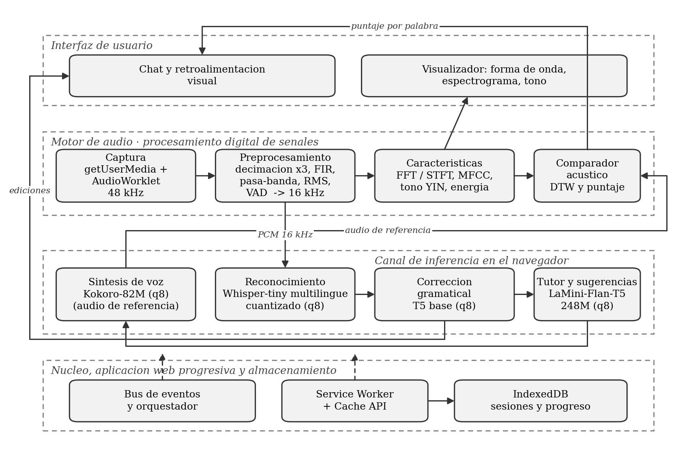

# My Personal English Teacher (MPET)
## Documento Técnico Final

**Curso:** Señales y Sistemas\
**Equipo:** Alejandro Zamora (Project Manager · Núcleo e Integración) · Fabrizio
Espinoza (Procesamiento Digital de Señales) · Isaac Morum (Inteligencia Artificial) ·
José Pablo Monestel (Interfaz y Visualización)\
**Repositorio:** https://github.com/HumanoidCat/mpet \
**Aplicación desplegada:** https://humanoidcat.github.io/mpet/

---

### Contenido

1. Descripción del problema
2. Justificación
3. Arquitectura propuesta a nivel macro
4. Objetivos
5. Marco teórico
6. Matriz de trazabilidad de requerimientos
7. Etapa de desarrollo y verificación de funcionalidades
8. Anexos

---

## 1. Descripción del problema

Aprender inglés conversacional es, para un hispanohablante, un problema distinto al de
aprender su gramática o su vocabulario. La dificultad central no es de conocimiento
sino de **producción oral**: el estudiante conoce la regla, pero no consigue pronunciar
de forma inteligible ni sostener una conversación con fluidez.

El problema tiene tres causas identificables.

**Barrera fonética.** El inventario fonológico del español cuenta con cinco vocales; el
del inglés supera las once, además de contrastes consonánticos inexistentes en español.
Pares mínimos como *ship*/*sheep* o *bad*/*bed* se colapsan en un mismo sonido para el
oído no entrenado. El estudiante no puede corregir lo que no distingue, y sin
retroalimentación externa el error se fosiliza.

**Falta de práctica conversacional accesible.** La práctica oral efectiva exige un
interlocutor que corrija en el momento. Las alternativas reales —tutorías privadas,
academias, intercambios— son costosas, dependen de horarios y requieren conexión
estable. En zonas con conectividad limitada, o para estudiantes con restricciones
económicas, esa práctica sencillamente no ocurre.

**Retroalimentación tardía o inexistente.** Las aplicaciones masivas de idiomas evalúan
mayoritariamente comprensión y gramática escrita. Cuando incorporan reconocimiento de
voz, devuelven un veredicto binario —*correcto* / *inténtalo de nuevo*— sin explicar
**qué** falló: si la vocal fue demasiado corta, si la entonación cayó donde debía subir,
si se omitió una consonante final.

### 1.1 El problema desde la perspectiva de Señales y Sistemas

Evaluar pronunciación de forma automática es, en el fondo, un problema de análisis de
señales. La voz es una señal continua que debe muestrearse respetando el criterio de
Nyquist, filtrarse para eliminar ruido y componentes fuera de la banda de interés, y
transformarse al dominio de la frecuencia para extraer las características que
efectivamente distinguen un fonema de otro. Las dificultades son concretas y medibles:

- **Ruido ambiental y variabilidad del canal.** El micrófono captura ruido de fondo,
  reverberación de la sala y distorsiones del propio dispositivo. Sin preprocesamiento,
  ese ruido contamina toda medición posterior.
- **Variabilidad acústica entre hablantes.** La misma palabra pronunciada por dos
  personas produce señales muy distintas en amplitud, duración y frecuencia
  fundamental. La comparación no puede hacerse muestra a muestra: requiere
  características robustas a esa variabilidad y alineamiento temporal.
- **Restricción de tiempo real.** El análisis debe ocurrir mientras el usuario habla,
  sin bloquear la interfaz, y con retroalimentación en menos de dos segundos para que
  la corrección resulte útil desde el punto de vista pedagógico.

El proyecto aborda estas dificultades aplicando muestreo y decimación con filtro
anti-aliasing, filtrado en banda de voz, transformada de Fourier de tiempo corto,
extracción de coeficientes cepstrales en escala mel, estimación de frecuencia
fundamental y alineamiento temporal dinámico. Todas estas etapas están implementadas a
mano y verificadas contra su definición matemática, según se detalla en la sección 5.

### 1.2 Alcance del sistema

MPET es una aplicación web progresiva que se ejecuta **por completo en el navegador**,
sin servidor de inferencia. Ofrece dos modalidades de trabajo, deliberadamente
distintas:

| Modalidad | Qué hace | Qué señal produce |
|---|---|---|
| **Conversación libre** | El estudiante habla o escribe sobre lo que quiera; el sistema transcribe, corrige la gramática, propone reformulaciones y responde | Corrección gramatical, sugerencias, respuesta hablada |
| **Práctica con frase objetivo** | El estudiante repite una frase concreta que el sistema propone y sintetiza | Todo lo anterior, más la evaluación de pronunciación |

La distinción no es cosmética y se justifica en la sección 7: **la pronunciación solo se
evalúa cuando existe una frase de referencia contra la cual compararla.** En
conversación libre no hay una pronunciación correcta definida, y puntuar sin referencia
produciría una cifra sin significado.

---

## 2. Justificación

### 2.1 Por qué el procesamiento ocurre en el cliente

El requisito de funcionamiento sin conexión no es una preferencia de implementación:
determina toda la arquitectura. Un sistema que dependa de un servidor de inferencia
falla exactamente en el escenario que el proyecto quiere atender —conectividad limitada
o intermitente— y traslada al usuario un costo por uso.

Ejecutar los modelos en el navegador impone tres restricciones que condicionan cada
decisión posterior:

1. **El peso de descarga es un recurso escaso.** Cada megabyte de modelo es tiempo de
   espera antes del primer uso. La aplicación descarga hoy 302.6 MiB antes de permitir
   el primer turno, y difiere 88.1 MiB adicionales hasta que el estudiante pulsa
   "escuchar" por primera vez.
2. **No hay aceleración garantizada.** El tiempo de ejecución de ONNX recurre a
   WebAssembly de un solo hilo en la mayoría de los equipos disponibles. Los modelos
   deben elegirse por lo que rinden en ese entorno, no por su calidad en abstracto.
3. **El hilo principal debe permanecer libre.** La visualización en tiempo real exige
   60 cuadros por segundo. Todo el procesamiento de señales y toda la inferencia se
   ejecutan fuera de él, en `AudioWorklet` y en trabajadores web.

### 2.2 Por qué las etapas de señales se implementan a mano

La transformada rápida de Fourier, el banco de filtros mel, el estimador de frecuencia
fundamental y el alineamiento temporal están escritos por el equipo, no tomados de una
biblioteca. Hay dos razones y ambas resultaron acertadas al medirlas.

La primera es de contenido: es un curso de Señales y Sistemas, y la implementación
demuestra los conceptos de una forma que la llamada a una biblioteca no puede.

La segunda es de verificación, y es la que importa técnicamente. Contrastar una
implementación contra otra biblioteca demuestra únicamente que ambas coinciden;
contrastarla contra resultados deducibles de la teoría —la magnitud exacta $N/2$ de una
senoide centrada en un *bin*, la conservación de la energía de Parseval, la simetría
conjugada de una señal real— demuestra que es **correcta**. Esta estrategia se aplicó de
forma sistemática y se documenta en la sección 7.4.

### 2.3 Por qué no se emplean servicios de reconocimiento del navegador

La `Web Speech API` ofrece reconocimiento de voz sin descargar ningún modelo, pero
delega el reconocimiento en servidores de terceros. Es incompatible con el requisito de
procesamiento local y con el de funcionamiento sin conexión. Se descartó por esa razón,
no por calidad.

---

## 3. Arquitectura propuesta a nivel macro

### 3.1 Principio rector

**Módulos desacoplados por contrato.** Cada integrante es responsable de un módulo cuya
interfaz pública quedó definida y congelada en la primera semana. Los módulos se
comunican mediante un bus de eventos y tipos compartidos en `src/shared/contracts.ts`.
Cada módulo dispone además de un **simulacro** de sus dependencias, de modo que ningún
integrante quede bloqueado esperando el trabajo de otro.

La consecuencia práctica es que la interfaz se desarrolló desde el primer día contra
transcripciones y puntajes simulados, y el núcleo pudo integrarse antes de que existiera
un solo modelo real. Toda modificación de los contratos compartidos requiere una
solicitud de incorporación marcada como `shared-change`, revisada por los cuatro.

### 3.2 Diagrama de bloques




### 3.3 Flujo de un turno de conversación

1. El estudiante pulsa el micrófono. El motor de audio captura a la frecuencia nativa
   del dispositivo —48 kHz en el hardware disponible— y decima a 16 kHz.
2. Preprocesamiento: filtro pasa-banda de 80 a 8 000 Hz, normalización por valor eficaz
   y detección de actividad de voz para recortar los silencios.
3. En paralelo: las características alimentan el visualizador en tiempo real, y el
   bloque de muestras se envía al reconocedor.
4. El reconocedor transcribe. Si el turno vino en español, una segunda pasada del mismo
   modelo devuelve la traducción al inglés (sección 3.5).
5. La transcripción pasa al corrector gramatical. **La transcripción y la corrección se
   emiten a la interfaz en cuanto están listas**, sin esperar al resto: es la
   retroalimentación que el estudiante necesita de inmediato y la que debe cumplir el
   presupuesto de dos segundos.
6. El tutor genera su respuesta y, después y en segundo plano, las sugerencias de
   reformulación. El orden importa: ambas salen del mismo modelo y del mismo trabajador,
   de modo que anteponer las sugerencias dejaría la respuesta esperando dos
   generaciones que nadie está esperando.
7. En modo práctica, el sintetizador produce el audio de referencia de la frase objetivo
   y el comparador acústico lo contrasta con lo que dijo el estudiante.

### 3.4 Estructura del repositorio

```
mpet/
├── public/               # manifiesto de la aplicación web progresiva, iconos
├── src/
│   ├── core/             # bus de eventos, orquestador, service worker
│   ├── audio/            # captura, dsp/, features/, comparator/
│   ├── ai/               # asr/, grammar/, suggestions/, tts/
│   ├── ui/               # chat/, visualizer/, feedback/, progress/, shell/
│   └── shared/           # tipos y contratos compartidos
├── tests/                # espejo de src/, por módulo
├── docs/                 # planificación, marco teórico, evidencias, entregas
└── mocks/                # simulacros por módulo
```

### 3.5 Decisiones técnicas justificadas

| Decisión | Alternativa descartada | Justificación |
|---|---|---|
| React 18 con Vite y TypeScript | JavaScript sin marco de trabajo | El aislamiento por componentes permite que cuatro personas trabajen sin interferir. Vite dispone de complemento oficial para aplicaciones web progresivas. |
| `transformers.js` con ONNX Runtime Web | `Web Speech API` como solución final | El requisito exige modelos ejecutados en el cliente; la interfaz del navegador delega en servidores externos. |
| FFT, banco mel, YIN y DTW implementados a mano | Emplear una biblioteca | Corresponde al contenido del curso, y permite verificar contra la definición en lugar de contra otra implementación (sección 2.2). |
| YIN para la frecuencia fundamental | Autocorrelación simple | La autocorrelación se implementó primero como referencia y expuso su límite: errores de suboctava. YIN los corrige y es citable. |
| Alineamiento temporal dinámico | Comparación trama a trama | Dos emisiones de la misma frase difieren en duración; el método clásico es explicable y su costo es despreciable frente al presupuesto. |
| `AudioWorklet` y trabajadores web | Procesar en el hilo principal | Es la condición para sostener la visualización en tiempo real. |
| **Kokoro-82M** para la síntesis | MMS-TTS, SpeechT5 | Medido con el mismo banco de palabras: 1 fallo de 14 frente a 7, pesa 88.1 MiB frente a 109.0, y es determinista. La determinación importa por una razón que se explica en 7.2. |
| **Whisper-tiny multilingüe** para el reconocimiento | Variante entrenada solo en inglés | Mismo peso y misma arquitectura, y añade la tarea de traducción, que es lo que hace bilingüe al sistema sin sumar un solo modelo (abajo). |
| **LaMini-Flan-T5-248M** para tutor y sugerencias | Modelo de chat multilingüe de 0.5 B parámetros | El modelo de chat se midió en la aplicación desplegada: entre 7 y 16 segundos por respuesta. El T5 responde en torno a 1.5 s. |

**El bilingüismo se resuelve en el reconocedor, no en el tutor.** Un estudiante
principiante recurre al español cuando todavía no consigue armar la frase en inglés, y
esa es precisamente la barrera que el proyecto quiere bajar. Atenderla parecía exigir un
tutor que entendiera español, lo que obligaba a un modelo de chat multilingüe y a su
latencia. La observación que lo resuelve es que **el tutor nunca necesitó saber
español**: necesitaba recibir en inglés lo que el estudiante quiso decir. Whisper
multilingüe —ya cargado para el reconocimiento— dispone de una tarea de traducción que
devuelve inglés desde cualquiera de sus idiomas. Un turno en español ejecuta una segunda
pasada del reconocedor sobre el mismo audio y entrega inglés al tutor rápido.

| | Con tutor multilingüe | Con traducción en el reconocedor |
|---|---|---|
| Latencia de la respuesta | 7 a 16 s | ~1.5 s |
| Atiende al estudiante en español | Sí | Sí |
| Origen de la traducción | Generada por el modelo de chat | Literal, la del reconocedor |
| Peso adicional | ~500 MiB | **Ninguno** |

El costo es una segunda pasada del reconocedor, y **solo cuando el turno vino en
español**: en inglés no hay nada que traducir y no se solicita.

---

## 4. Objetivos

### 4.1 Objetivo general

Desarrollar una aplicación web progresiva que permita practicar inglés conversacional
con retroalimentación de pronunciación y gramática, ejecutando la totalidad del
procesamiento de señales y de la inferencia en el navegador del usuario, sin servidores
y sin conexión permanente a internet.

### 4.2 Objetivos específicos

| # | Objetivo | Criterio de cumplimiento | Estado |
|---|---|---|---|
| O1 | Implementar la cadena de adquisición y preprocesamiento de voz | Decimación exacta a 16 kHz con supresión de alias verificada | Cumplido: 73.8 dB de atenuación |
| O2 | Implementar el análisis espectral sobre implementación propia | Error frente a la transformada por definición inferior a 10⁻¹⁰ | Cumplido: 1.45×10⁻¹³ |
| O3 | Extraer características fonéticamente discriminantes | Error de los coeficientes cepstrales inferior al 5 % frente a una referencia externa | Cumplido: 0.009 % |
| O4 | Estimar la frecuencia fundamental de la voz | Error inferior a 3 Hz sobre tonos de parámetros conocidos | Cumplido: 0.115 Hz |
| O5 | Evaluar la pronunciación frente a una referencia | Detectar el error de un par mínimo | Cumplido en modo práctica: 8 de 10; **no alcanzado por la vía acústica**: 6 de 10 (sección 7.2) |
| O6 | Integrar reconocimiento, corrección y síntesis en el cliente | Un turno completo sin llamadas de red tras la carga inicial | Cumplido |
| O7 | Entregar la retroalimentación dentro del presupuesto pedagógico | Transcripción y corrección en menos de 2 s | Cumplido: entre 397 y 1 282 ms medidos |
| O8 | Sostener la visualización en tiempo real | 30 cuadros por segundo o más sin bloquear la interfaz | Cumplido: el análisis consume 2.14 % de un núcleo |

---

## 5. Marco teórico

Esta sección recorre la cadena de procesamiento en el orden en que la señal la
atraviesa. Cada etapa se presenta con su formulación, el valor de los parámetros
adoptados y la justificación de por qué se eligieron esos valores y no otros.

### 5.1 Muestreo y teorema de Nyquist–Shannon

La voz es una señal continua de presión acústica $x(t)$. Para procesarla se convierte
en una secuencia discreta tomando muestras cada $T_s$ segundos:

$$x[n] = x(nT_s), \qquad f_s = \frac{1}{T_s}$$

El teorema de muestreo establece que una señal limitada en banda a $f_{max}$ se
reconstruye sin pérdida si $f_s > 2f_{max}$. La mitad de la frecuencia de muestreo es
la **frecuencia de Nyquist**:

$$f_N = \frac{f_s}{2}$$

El sistema trabaja a $f_s = 16\,000$ Hz, de modo que $f_N = 8\,000$ Hz. Esa elección la
impone el reconocedor de voz, pero coincide con lo que exige el contenido fonético:

| Componente | Rango típico | Por debajo de 8 kHz |
|---|---|---|
| Frecuencia fundamental, voz masculina | 85–180 Hz | Sí |
| Frecuencia fundamental, voz femenina | 165–255 Hz | Sí |
| Formantes F1 a F3 (vocales) | 300–3 500 Hz | Sí |
| Fricativas (/s/, /ʃ/, /f/) | 4 000–8 000 Hz | Sí, al límite |

Toda la información fonética que necesita el evaluador vive por debajo de la
frecuencia de Nyquist. Por ello el rango de búsqueda de la frecuencia fundamental se
acota a 60–400 Hz y el filtro pasa-banda del preprocesamiento va de 80 a 8 000 Hz.

**El aliasing y por qué determina el diseño del remuestreo.** Una componente que supere
$f_N$ no se pierde: se pliega dentro de la banda útil y se confunde con una frecuencia
legítima. La frecuencia aparente es

$$f_{alias} = \left| \left( (f + f_N) \bmod f_s \right) - f_N \right|$$

Una componente de 9 kHz muestreada a 16 kHz aparece en 7 kHz, exactamente en la banda de
las fricativas. Por eso la decimación va **siempre** precedida de un filtro pasa-bajos.

**Medición sobre el hardware disponible.** El micrófono entrega 48 000 Hz y no admite
otro valor: el dispositivo declara un rango soportado de 48 000 a 48 000 Hz. La relación
$48\,000/16\,000 = 3$ es entera, de modo que corresponde una **decimación exacta**:
filtrar por debajo de la nueva frecuencia de Nyquist y conservar una de cada tres
muestras. El corte se sitúa en 7 200 Hz, con un 10 % de margen para la caída del filtro.

El navegador ofrece hacer esa conversión por su cuenta, y aun así el remuestreo se
implementa en el proyecto. El filtro anti-aliasing del navegador no está documentado, y
ese filtro es precisamente el contenido que el proyecto debe evidenciar.

| Medición del filtro de decimación | Valor |
|---|---:|
| Longitud del filtro FIR de fase lineal | 127 coeficientes |
| Atenuación en la banda suprimida | **73.8 dB** |
| Frecuencia de corte | 7 200 Hz |

### 5.2 Preprocesamiento

Tres operaciones, en este orden, antes de cualquier análisis.

**Filtro pasa-banda de 80 a 8 000 Hz**, realizado como cascada de secciones bicuadráticas
de Butterworth. El límite inferior elimina el ruido de baja frecuencia —corriente de la
red, manipulación del micrófono, componente continua— que no contiene información
fonética y sí desplaza el nivel. La respuesta se verifica contra la teoría: la
atenuación en las frecuencias de corte mide **−3.01 dB**, que es el valor exacto de la
media potencia.

**Normalización por valor eficaz.** La amplitud absoluta depende de la distancia al
micrófono y de su ganancia, no de cómo se pronuncia. Se normaliza para que la
comparación posterior no mida el volumen.

**Detección de actividad de voz.** Decide dónde empieza y dónde termina el habla dentro
de la grabación, con dos objetivos: no enviar silencio al reconocedor y no incluir en la
comparación tramos sin contenido. El criterio combina energía y **periodicidad**: la
energía sola clasifica como habla cualquier ruido estacionario de nivel suficiente.
Medido sobre ruido de banda ancha frente a voz sintética, la fracción de tramas con
frecuencia fundamental detectable es de **0 % frente a 49 %**, lo que separa ambos casos
sin ambigüedad.

### 5.3 Transformada discreta de Fourier

Para determinar qué frecuencias contiene una trama de audio se pasa del dominio del
tiempo al de la frecuencia:

$$X[k] = \sum_{n=0}^{N-1} x[n]\, e^{-j 2\pi k n / N}, \qquad k = 0, 1, \dots, N-1$$

Cada índice $k$ corresponde a la frecuencia física $f_k = k f_s / N$. Con $N = 512$ y
$f_s = 16$ kHz, la resolución espectral es

$$\Delta f = \frac{f_s}{N} = \frac{16\,000}{512} = 31.25 \text{ Hz por índice}$$

y la trama dura $N/f_s = 32$ ms.

**El compromiso tiempo–frecuencia.** Tramas más largas dan mejor resolución en
frecuencia y peor en tiempo. Los 32 ms adoptados son el compromiso habitual en
procesamiento de voz: suficientemente cortos para que el tracto vocal pueda considerarse
estacionario, suficientemente largos para resolver los formantes. Como $x[n]$ es real, el
espectro presenta simetría conjugada y basta conservar $N/2 + 1 = 257$ valores.

**Transformada rápida.** La evaluación directa cuesta $O(N^2)$. El algoritmo radix-2 de
Cooley–Tukey lo reduce a $O(N\log N)$ separando recursivamente las muestras de índice par
e impar: para $N = 512$, de unas 262 000 operaciones a unas 4 600. La implementación es
iterativa y con tabla de factores de giro precalculada. El error frente a la transformada
por definición, implementada dentro de las propias pruebas, mide $1.45\times10^{-13}$.

**Enventanado.** Cortar el audio en tramas equivale a multiplicar por una ventana
rectangular, cuyos flancos abruptos introducen fuga espectral. Se aplica una ventana de
Hann:

$$w[n] = 0.5\left(1 - \cos\left(\frac{2\pi n}{N}\right)\right), \qquad n = 0,\dots,N-1$$

Se emplea la variante **periódica** —divisor $N$ y no $N-1$—, que es la correcta para
análisis espectral: hace que la ventana empalme consigo misma al repetirse, que es
exactamente lo que la transformada discreta supone de la señal.

Efecto medido con un tono situado entre dos índices, el caso más desfavorable:

| Ventana | Fuga a más de 5 índices del pico |
|---|---:|
| Rectangular | −21.5 dB |
| **Hann** | **−52.7 dB** |
| Hamming | −41.3 dB |
| Blackman | −62.3 dB |

Hann deja la fuga 31 dB por debajo de no enventanar. Blackman la reduce aún más, pero
ensancha el lóbulo principal y con ello cuesta resolución para separar formantes
próximos, que es justamente lo que el sistema necesita distinguir.

**Corrección por ganancia coherente.** Enventanar atenúa la señal: la media de la ventana
de Hann vale 0.5, de modo que el espectro sale a la mitad. Para recuperar la amplitud
real se divide por esa media:

$$\bar{w} = \frac{1}{N}\sum_{n=0}^{N-1} w[n] = 0.5
\quad\Longrightarrow\quad
|X_{\text{corr}}[k]| = \frac{2\,|X[k]|}{N\bar{w}}$$

Verificado con un error del 0.00 % sobre las amplitudes probadas.

### 5.4 Transformada de tiempo corto

Una sola transformada indica qué frecuencias hay, pero no cuándo. Para voz eso no basta:
*cat* y *tac* presentan prácticamente el mismo espectro global y son palabras distintas.
La transformada de tiempo corto trocea la señal y transforma cada trama por separado:

$$X[m,k] = \sum_{n=0}^{N-1} x[n+mH]\, w[n]\, e^{-j2\pi kn/N}$$

donde $m$ es el índice de trama, $H$ el salto y $w[n]$ la ventana. El resultado es una
matriz tiempo–frecuencia: el **espectrograma**.

| Parámetro | Valor | Consecuencia |
|---|---:|---|
| Tamaño de trama *N* | 512 | 32 ms por trama |
| Salto *H* | 256 | 50 % de solapamiento, 62.5 tramas/s |
| Resolución Δ*f* | 31.25 Hz | separación entre índices espectrales |
| Resolución Δ*t* | 16 ms | separación entre tramas |

El producto $\Delta f \cdot \Delta t$ no puede reducirse arbitrariamente: es el principio
de incertidumbre aplicado a señales. El solapamiento del 50 % evita perder las
transiciones entre fonemas.

**Verificación.** Sobre un barrido lineal de 500 a 4 000 Hz en un segundo, cada trama del
espectrograma coincide con la frecuencia instantánea en su punto medio dentro de dos
índices.

### 5.5 Coeficientes cepstrales en escala mel

Son las características con las que se compara la pronunciación. La cadena completa es

$$x[n] \;\to\; w[n]x[n] \;\to\; |X[k]|^2 \;\to\; E[m] \;\to\; \log E[m] \;\to\; c[i]$$

y cada paso descarta deliberadamente algo que **no** debe influir en la comparación.

**Escala mel.** El oído no percibe la frecuencia de forma lineal: se distingue con
facilidad 200 de 300 Hz, mientras que 5 000 y 5 100 Hz suenan casi igual. La escala mel
refleja esa percepción:

$$m(f) = 2595 \log_{10}\left(1 + \frac{f}{700}\right),
\qquad
f(m) = 700\left(10^{m/2595} - 1\right)$$

Es casi lineal por debajo de 1 kHz y logarítmica por encima, que es donde reside la
información de las vocales. Se adopta la formulación de HTK, estándar en reconocimiento
de voz.

**Banco de filtros triangulares.** Se reparten $M+2$ puntos equiespaciados en mel entre 0
y la frecuencia de Nyquist, se convierten a hercios y de ahí a índices espectrales. Cada
filtro emplea tres puntos consecutivos:

$$H_m[k] = \begin{cases}
\dfrac{k - b_{m-1}}{b_m - b_{m-1}} & b_{m-1} < k < b_m \\[2ex]
\dfrac{b_{m+1} - k}{b_{m+1} - b_m} & b_m \le k < b_{m+1} \\[1ex]
0 & \text{en otro caso}
\end{cases}$$

y la energía de cada banda resulta

$$E[m] = \sum_k H_m[k]\,|X[k]|^2$$

Con $M = 26$ bandas los 257 valores espectrales se reducen a 26. El ancho crece con la
frecuencia, de 75 Hz en la primera banda a 706 Hz en la última. Ese agrupamiento **borra
los armónicos individuales** —que se desplazan con el tono de quien habla— y conserva la
envolvente, que es lo que define el fonema.

**Logaritmo y transformada del coseno.** El logaritmo convierte productos en sumas. La
voz es la fuente glotal filtrada por el tracto vocal, y en el espectro eso constituye un
producto; al tomar logaritmo, fuente y filtro se separan en sumandos. Además, un cambio
de volumen deja de ser un factor y pasa a ser un desplazamiento constante.

La transformada discreta del coseno de tipo II, en su versión ortonormal, descorrelaciona
bandas que se solapan y están fuertemente correlacionadas:

$$c[i] = \alpha_i \sum_{m=0}^{M-1} \log E[m]\,
\cos\left(\frac{\pi i (2m+1)}{2M}\right),
\qquad
\alpha_i = \begin{cases}\sqrt{1/M} & i = 0\\ \sqrt{2/M} & i > 0\end{cases}$$

Tras esta transformación la información se concentra en los primeros coeficientes, de
modo que bastan los trece primeros de los veintiséis. La normalización ortonormal
**conserva la energía**, condición necesaria para que la distancia entre dos vectores de
coeficientes signifique lo mismo que en el dominio original; sin ella, la comparación de
la sección 5.7 carecería de sentido métrico.

**La propiedad que justifica su empleo.** Multiplicar la señal por una ganancia $g$
multiplica la potencia por $g^2$, lo que suma $20\log_{10}g$ decibelios **a todas las
bandas por igual**. La transformada del coseno envía una constante al coeficiente cero:

$$c_0 \to c_0 + \sqrt{M}\cdot 20\log_{10}g,
\qquad
c_i \to c_i \;\;(i>0)$$

Los coeficientes $c_1$ a $c_{12}$ **no dependen del volumen**. Medido sobre un rango de
ganancia de mil veces, el mayor cambio observado es $3.8\times10^{-6}$.

**Verificación cruzada.** La cadena se contrastó contra librosa 0.11.0 sobre seis casos
—tonos puros, vocales sintéticas y ruido—, con un error máximo de **0.009 %** frente al
5 % que exigía el criterio. Ese contraste tuvo además un valor diagnóstico: la primera
versión aplicaba al espectro de potencia una corrección de amplitud que hundía
veinticuatro de las veintiséis bandas por debajo del valor mínimo que evita el logaritmo
de cero, de modo que dejaban de responder a la señal. Retirada esa corrección, el error
desciende de 5.02 % a 0.009 %. La validación por etapas no lo había detectado porque cada
etapa era correcta por separado: el defecto residía en la escala con que se encadenaban.

### 5.6 Estimación de la frecuencia fundamental

**Punto de partida y su límite.** La autocorrelación mide cuánto se parece una señal a sí
misma desplazada $\tau$ muestras:

$$r[\tau] = \sum_n x[n]\,x[n+\tau]$$

Si la señal es periódica de periodo $T$, presenta un máximo en $\tau = T$. Se calcula por
el teorema de Wiener–Khinchin, que la reduce a $O(N\log N)$:

$$r = \mathcal{F}^{-1}\left\{|X[k]|^2\right\}$$

Su problema, medido: existen máximos en **todos los múltiplos** del periodo, y con una
fundamental débil frente a su armónico el método responde el doble de la frecuencia real
—el error de octava— y lo hace con confianza alta, de modo que el error no es detectable
desde su propia salida.

**Función de diferencia.** El algoritmo YIN mide cuánto se **diferencia** la señal de sí
misma desplazada, en lugar de cuánto se parece:

$$d[\tau] = \sum_{j=0}^{W-1}\left(x[j] - x[j+\tau]\right)^2$$

Buscar mínimos en lugar de máximos evita el sesgo hacia desfases cortos que aparece
cuando la amplitud varía dentro de la trama. Desarrollando el cuadrado, también se
calcula mediante transformada.

**Normalización por la media acumulada.** Es el paso decisivo:

$$d'[\tau] = \begin{cases}
1 & \tau = 0\\[1ex]
\dfrac{d[\tau]}{\frac{1}{\tau}\sum_{j=1}^{\tau} d[j]} & \tau > 0
\end{cases}$$

Cada desfase se compara contra el promedio de todos los anteriores. Al llegar a $2T$ ese
promedio ya incluye el mínimo profundo de $T$, de manera que un múltiplo deja de competir
de igual a igual con el periodo verdadero. Medido sobre el caso patológico —fundamental
6.7 veces más débil que su segundo armónico—, $d'[T] = 0.00000$ frente a
$d'[T/2] = 0.04369$.

**Umbral y decisión de diseño.** Se toma el **primer** desfase que baja del umbral, no el
mínimo global; sin esa regla un múltiplo ligeramente más profundo volvería a imponerse.

El artículo original propone 0.1. Este proyecto emplea **dos umbrales distintos**, y la
separación es una decisión deliberada:

| Umbral | Valor | Para qué |
|---|---:|---|
| Determinar **qué frecuencia** es | 0.02 | Calibrado por medición: con 0.1 el valle falso del armónico (0.044) también califica y, por la regla del primero, se impone |
| Decidir **si hay periodicidad** | 0.15 | Aplicado a la detección de actividad de voz |

Unificar ambos, como se hizo en una primera versión, rechazaba por completo el habla de
dos de las primeras cuatro grabaciones reales. Aflojar el umbral de detección no tiene
costo apreciable: el ruido de banda ancha presenta 0 % de tramas sonoras para cualquier
valor entre 0.02 y 0.30.

**Interpolación parabólica.** El vértice de la parábola que pasa por los tres puntos
alrededor del mínimo:

$$\tau^{*} = \tau_0 + \frac{d'[\tau_0-1] - d'[\tau_0+1]}
{2\left(d'[\tau_0-1] - 2d'[\tau_0] + d'[\tau_0+1]\right)}$$

Es lo que otorga la exactitud final: a 16 kHz, un tono de 200 Hz tiene un periodo de 80
muestras, y quedarse con el desfase entero erraría hasta media muestra. **Peor error
medido: 0.115 Hz** en el rango de 70 a 390 Hz, frente al criterio de 3 Hz.

La confianza se define como $1 - d'[\tau^{*}]$, es decir, la periodicidad medida. A
diferencia de la altura de un pico de autocorrelación, este indicador **sí desciende**
cuando la estimación se degrada.

### 5.7 Comparación mediante alineamiento temporal dinámico

**El problema.** Dos personas nunca dicen la misma frase a la misma velocidad. Comparar
las secuencias de coeficientes trama a trama mediría quién habla más rápido.

**La recurrencia.** El alineamiento temporal dinámico busca la correspondencia óptima
entre ambas líneas de tiempo:

$$D[i,j] = d(i,j) + \min\big(D[i-1,j],\; D[i,j-1],\; D[i-1,j-1]\big)$$

donde $d(i,j)$ es la distancia euclídea entre la trama $i$ del usuario y la $j$ de la
referencia. Los tres términos del mínimo corresponden a los tres movimientos permitidos:
el usuario alargó, acortó, o ambos van al mismo ritmo. El camino de menor costo es
**monótono** —el tiempo no retrocede— y **continuo** —no se omiten tramas—, propiedades
que se desprenden de la propia recurrencia.

La distancia se normaliza por la longitud del camino, de modo que frases de distinta
duración resulten comparables:

$$\bar{D} = \frac{D[n-1,m-1]}{|\text{camino}|}$$

**Restricción de Sakoe–Chiba.** Sin límite, el alineamiento puede deformar el tiempo lo
que haga falta y emparejar una sílaba con otra muy posterior. Se acota la desviación
respecto de la diagonal a un 15 % de la secuencia más larga.

**Normalización cepstral.** La referencia la genera el sintetizador de voz, de modo que
usuario y referencia son **siempre** hablantes distintos. Lo que los diferencia es sobre
todo una inclinación espectral constante a lo largo del enunciado —longitud del tracto
vocal, tono, micrófono—, y esa componente constante es la media. Restarla deja lo que
varía dentro de la frase, que es la secuencia de fonemas:

$$\tilde{c}_i[m] = c_i[m] - \frac{1}{M}\sum_{m'} c_i[m']$$

Medido sobre frases de tres vocales sintéticas:

| | Peor caso bien pronunciado | Mejor caso mal pronunciado |
|---|---:|---:|
| Sin normalizar | 39.39 | 11.66 — las clases se solapan |
| Normalizado | 6.45 | 17.91 — separadas por un factor de 2.8 |

Sin esta normalización, una pronunciación **correcta con otra voz** puntúa **peor** que
una **equivocada con la misma voz**. No debe aplicarse a sonidos sostenidos: en una señal
estacionaria la media *es* la señal, y restarla borra la información.

**Del costo a la puntuación.**

$$P = 100 \cdot e^{-(\bar{D} - D_0)/\lambda},
\qquad \lambda = 20, \qquad D_0 = 7.08$$

La exponencial está acotada por construcción —nunca resulta negativa ni supera 100, sin
necesidad de recortes— y presenta mayor pendiente cerca de cero, que es donde conviene
distinguir. La constante $\lambda$ está calibrada con las distancias medidas.

El término $D_0$ es un **suelo de distancia**, y su valor no es arbitrario: es
exactamente lo que cuesta cambiar de hablante, medido sobre cuarenta grabaciones
(sección 7.2). Comparar contra una voz sintética impone ese costo a cualquier emisión,
incluso a una pronunciada perfectamente. Descontarlo evita que un estudiante que dice la
frase bien reciba una puntuación baja por un motivo que no depende de él. La curva
teórica conserva $D_0 = 0$; el suelo se aplica únicamente en la configuración de
producción, donde la referencia es sintética.

---

## 6. Matriz de trazabilidad de requerimientos

Formato exigido por el curso: identificador, descripción, prioridad, fuente, módulo,
estado, prueba de verificación y métrica. Se presenta en dos tablas por legibilidad; el
identificador es la clave que las relaciona.

### 6.1 Estado por requerimiento

| ID | Requerimiento | Prioridad | Fuente | Módulo | Estado |
|---|---|---|---|---|---|
| RF-01 | Captura de micrófono | Alta | Curso | `src/audio/capture` | **Implementado** |
| RF-02 | Preprocesamiento: filtrado y normalización | Alta | Curso | `src/audio/dsp` | **Implementado** |
| RF-03 | Visualización de forma de onda en tiempo real | Alta | Curso | `src/ui/visualizer` | **Implementado** |
| RF-04 | Reconocimiento de voz sin conexión | Alta | Curso | `src/ai/asr` | **Implementado y verificado en ejecución** |
| RF-05 | Corrección gramatical con resaltado | Alta | Curso | `src/ai/grammar` + `src/ui/chat` | **Implementado y verificado en ejecución** |
| RF-06 | Interfaz tipo chat con botón de micrófono | Alta | Curso | `src/ui/chat` | **Implementado** |
| RF-07 | Espectrograma en tiempo real con transformada propia | Alta | Curso | `src/audio/dsp` + `src/ui/visualizer` | **Implementado** |
| RF-08 | Estimación de frecuencia fundamental | Alta | Curso | `src/audio/features` | **Implementado** |
| RF-09 | Extracción de coeficientes cepstrales | Alta | Curso | `src/audio/features` | **Implementado y verificado** |
| RF-10 | Evaluación de pronunciación frente a referencia | Alta | Curso | `src/audio/comparator` + `src/core` + `src/ui/feedback` | **Implementado con alcance acotado** |
| RF-11 | Síntesis de voz para las respuestas | Alta | Curso | `src/ai/tts` | **Implementado** |
| RF-12 | Sugerencias de reformulación | Media | Curso | `src/ai/suggestions` | **Implementado** |
| RF-13 | Turno completo: habla → respuesta hablada + sugerencias | Alta | Curso | `src/core/orchestrator` | **Implementado** |
| RF-14 | Aplicación web progresiva instalable | Alta | Curso | `src/core` + Workbox | **Implementado** |
| RF-15 | Caché de modelos con descarga progresiva | Alta | Curso | Cache API | **Implementado** |
| RF-16 | Todo el procesamiento en el cliente | Alta | Curso | Toda la aplicación | **Implementado** |
| RF-17 | Retroalimentación visual con color | Alta | Curso | `src/ui/feedback` + `src/ui/chat` | **Implementado** |
| RF-18 | Documento técnico con estructura obligatoria | Alta | Curso | `docs/entregas/` | **Completo** |
| RF-19 | Presentación con demostración en vivo | Alta | Curso | Entregables | **Completo** |
| RF-20 | Matriz de trazabilidad actualizada por entrega | Alta | Curso | Este documento | **Completo** |
| RF-21 | Verificación con métricas y casos límite | Alta | Curso | `tests/` | **Implementado** |
| RF-22 | Marco teórico con ecuaciones | Alta | Curso | Sección 5 | **Completo** |
| RF-23 | Análisis de progreso entre sesiones | Baja | Curso | `src/ui/progress` + IndexedDB | **Implementado** |

### 6.2 Verificación y métricas

| ID | Prueba de verificación | Métrica obtenida |
|---|---|---|
| RF-01 | Captura real integrada por el adaptador del núcleo; 13 pruebas del adaptador y del acumulador de tramas | 48 kHz detectados; decimación exacta ×3 |
| RF-02 | 113 pruebas: respuesta del FIR, del pasa-banda y estabilidad del nivel | Corte 7 200 Hz; **73.8 dB** de atenuación de alias; **−3.01 dB** en corte |
| RF-03 | Lienzo alimentado por el motor real; inspección con señal real y sintética | 62.5 tramas/s desde el motor |
| RF-04 | Turnos completos en la aplicación desplegada; pruebas unitarias del trabajador | Factor de tiempo real **0.28–0.31**; 41 MB en caché; multilingüe con tarea de traducción |
| RF-05 | Turnos cronometrados en la aplicación desplegada; diferenciador con pruebas unitarias | **397 a 1 282 ms** de punta a punta con el reconocimiento incluido; 6 de 8 frases corregidas en el banco de prueba |
| RF-06 | Flujo completo con estados inactivo / grabando / procesando | Máquina de estados del orquestador verificada |
| RF-07 | Transformada verificada contra la definición, Parseval y casos analíticos; espectrograma con pruebas de mapa de color | Error **1.45×10⁻¹³**; 30 cuadros por segundo o más |
| RF-08 | 36 pruebas de YIN y 34 de autocorrelación sobre tonos de 70 a 390 Hz | Criterio < 3 Hz → **0.115 Hz** |
| RF-09 | 28 pruebas contra la definición de cada etapa, más contraste con librosa 0.11.0 | Criterio < 5 % → **0.009 %** |
| RF-10 | Cuarenta grabaciones de dos hablantes; comparación de ambas vías | Vía acústica: 6 de 10. **Vía de transcripción contra frase objetivo: 8 de 10.** La señal principal es la segunda (sección 7.2) |
| RF-11 | Banco de 14 palabras trampa y 5 de control, mismo criterio para los tres modelos evaluados | **1 fallo de 14** y **0 de 5**; **determinista**; **88.1 MiB** |
| RF-12 | Modelo elegido midiendo; filtros de salida con pruebas unitarias | Reescrituras verificadas en la aplicación desplegada; las que repiten la frase original o no son reescrituras se descartan |
| RF-13 | 33 pruebas de núcleo; turnos cronometrados en la aplicación desplegada | Retroalimentación por debajo de 2 s; respuesta del tutor ~1.5 s |
| RF-14 | Manifiesto y trabajador de servicio generados en la compilación; instalación verificada | Aplicación instalable; recursos estáticos precacheados |
| RF-15 | Segunda carga servida desde caché, con progreso reportado a la interfaz | Los modelos no se vuelven a descargar entre sesiones |
| RF-16 | Ausencia de servidor; inspección de red durante la inferencia | Cero llamadas a servicios externos |
| RF-17 | Umbrales con pruebas unitarias; regla explícita de precedencia entre esquemas | Verde ≥ 80, amarillo 60–79, rojo < 60. La señal de transcripción se redacta como «no entendí bien», nunca como «lo dijiste mal» |
| RF-18 | Revisión contra la estructura del curso | 8 de 8 secciones |
| RF-19 | Ensayo cronometrado con la aplicación desplegada | 10 a 15 minutos |
| RF-20 | Revisión en cada hito y al fusionar cada solicitud de incorporación | 23 requerimientos mapeados |
| RF-21 | **655 pruebas en 46 archivos**, ejecutadas en integración continua | 8 pruebas se omiten automáticamente cuando falta material que no se versiona |
| RF-22 | Revisión del documento | Formulación de cada etapa de la cadena, con parámetros y su justificación |
| RF-23 | Listado de sesiones anteriores con fecha, turnos, palabras y puntuación, más la diferencia contra la sesión previa | Evolución visible entre sesiones; racha de días y frases dominadas |

**Correspondencia con los criterios de evaluación.** Calidad técnica (40 %) → RF-01 a
RF-17 y RF-21 · Documento (30 %) → RF-18, RF-20 y RF-22 · Presentación (20 %) → RF-19 ·
Innovación (10 %) → RF-23 junto con las visualizaciones avanzadas de RF-07 y RF-08.

---

## 7. Etapa de desarrollo y verificación de funcionalidades

### 7.1 Resultados del procesamiento de señales

La cadena operativa quedó completa:

```
captura → remuestreo → preprocesamiento → detección de voz →
análisis espectral → frecuencia fundamental → coeficientes cepstrales →
alineamiento temporal → puntuación
```

**Mediciones frente a los criterios del plan.**

| Requisito | Criterio | Resultado medido |
|---|---|---|
| RF-08 · Frecuencia fundamental | Error < 3 Hz | **0.115 Hz** |
| RF-09 · Coeficientes cepstrales | Error < 5 % frente a librosa | **0.009 %** |
| RF-10 · Puntuación de pronunciación | Discriminación > 20 puntos | **No alcanzado por la vía acústica** (véase 7.2) |

**Invariancias de la puntuación.** Tres factores que no deben influir en la evaluación,
cada uno atendido por una etapa distinta de la cadena. Se distingue lo verificado sobre
señales sintéticas de lo comprobado con voz real:

| Factor que varía | Señales sintéticas | Voz real | Etapa responsable |
|---|---:|---|---|
| Ninguno (señal idéntica) | 100 | — | — |
| Volumen (+50 %) | > 95 | Se mantiene | Normalización por valor eficaz y descarte del coeficiente cero |
| Velocidad (+50 % de duración) | > 90 | **Parcial**: hablar deprisa aleja más que pronunciar mal en 1 de 5 frases | Alineamiento temporal |
| Voz del hablante | > 70 (120 → 180 Hz) | **No se cumple**: 37 frente a 49 | Normalización cepstral |

La invariancia a la velocidad se degrada porque al hablar deprisa las vocales se reducen
y el espectro cambia efectivamente; el alineamiento corrige la compresión del tiempo,
pero no una diferencia que no es temporal. Se comprobó que no se trata de un alineamiento
forzado: suprimir la banda de Sakoe–Chiba deja la distancia idéntica en catorce de quince
pares.

**Costo computacional.** El análisis en tiempo real consume **2.14 % de un núcleo**. Una
frase de tres segundos requiere aproximadamente 67 ms frente a un presupuesto de 2 000 ms
por turno, es decir un 3.3 %.

| Etapa | Milisegundos por segundo de audio |
|---|---:|
| Frecuencia fundamental | 10.70 |
| Remuestreo | 4.83 |
| Coeficientes cepstrales | 3.04 |
| Análisis espectral | 2.41 |
| Preprocesamiento y detección de voz | 0.38 |
| **Total** | **21.37** |

El comparador se ejecuta una vez por turno y requiere 2.45 ms para frases de tres
segundos. **El procesamiento de señales no constituye el factor limitante de la
latencia**; ese papel corresponde a la inferencia de los modelos.

**Optimizaciones aplicadas.** Dado que el módulo no limita la latencia, la optimización
se dirigió a los dos casos donde existía desperdicio identificable, y no a los más
costosos en términos absolutos.

| Optimización | Fundamento | Mejora medida |
|---|---|---|
| Reutilización de los planes de transformada | Se reconstruía la tabla de factores de giro en cada trama, 62.5 veces por segundo | **29.7 %** en la estimación de frecuencia fundamental |
| Decimación polifásica | Se filtraban 1 024 muestras por bloque para conservar 341: dos de cada tres productos se calculaban para descartarse | **3.00×**, coincidente con el factor de decimación |

La segunda no altera la señal de salida en ninguna muestra: la verificación consiste en
que las dieciséis pruebas de remuestreo preexistentes siguen superándose sin
modificación.

### 7.2 La evaluación de pronunciación: qué se midió y qué se concluyó

Este es el resultado más importante del proyecto, y el que determinó el diseño final de
la funcionalidad.

**El planteamiento inicial.** Comparar los coeficientes cepstrales del estudiante contra
los de una referencia sintetizada, alineados temporalmente, y convertir la distancia en
una puntuación. Sobre señales sintéticas el método separa las clases por 31 puntos, por
encima de los 20 que exigía el criterio.

**Lo que ocurre con voz real.** Medido sobre cuarenta grabaciones de dos hablantes que
cumplen el protocolo:

| Escenario | Detecta el error | Diferencia de puntuación |
|---|---|---|
| Referencia de la **misma voz** | 9 de 10 frases | 2.4 a 10.6 |
| Referencia de **otra voz** — el caso real de la aplicación | **6 de 10** | **−3.0 a +11.0** |

En la aplicación la referencia la sintetiza el conversor de texto a voz, de modo que el
escenario aplicable es el segundo. La causa está cuantificada: **cambiar de voz cuesta
7.08 unidades de distancia y pronunciar mal, 1.20.** La identidad del hablante domina la
medición por un factor de casi seis.

**El origen no es un defecto de implementación.** Los coeficientes están verificados
contra librosa con 0.009 % de error. Es el límite del método: comparar coeficientes
cepstrales mediante alineamiento mide **parecido acústico**, y la longitud del tracto
vocal escala las frecuencias de los formantes en los mismos coeficientes que distinguen
una vocal de otra. No es posible suprimir uno sin suprimir el otro. Se ensayaron ocho
procedimientos de normalización y se documenta la medición de cada uno.

Los sistemas que puntúan pronunciación de forma independiente del hablante no comparan
contra una grabación, sino contra un **modelo acústico de fonemas** entrenado con miles
de voces, y evalúan la probabilidad de que lo emitido corresponda al fonema esperado. Ese
enfoque requiere entrenamiento y excede el alcance del curso.

**La vía que sí funciona, y por qué estaba disponible.** El reconocedor de voz que el
proyecto ya integra **es** un modelo acústico entrenado con miles de hablantes.
Comparando la **transcripción** contra una frase objetivo, el error se manifiesta en el
texto y la identidad del hablante deja de intervenir. Medido sobre las mismas cuarenta
grabaciones, con la regla más simple posible —se marca error cuando lo transcrito no
coincide con la frase que se pidió repetir— y sin ningún umbral que calibrar:

| Vía | Errores detectados | Tomas correctas marcadas |
|---|---:|---:|
| Acústica, referencia de otra voz | 6 de 10 | — |
| **Transcripción contra frase objetivo** | **8 de 10** | 14 de 30 |

Detecta un tercio más de errores. El costo es que marca catorce de las treinta tomas
correctas, cifra que exige interpretación: las tomas correctas se grabaron *lo mejor que
se pudo*, no con pronunciación nativa. Que el reconocedor oiga *chip* donde se dijo
*ship* no constituye un fallo del método, sino información real sobre esa emisión. Por
eso la cifra se reporta como «tomas correctas marcadas» y no como «falsas alarmas».

El desglose por frase muestra el rango de comportamiento:

| Frase | Detecta | Marca correctas | Observación |
|---|---:|---:|---|
| *ship* / *sheep* | 2 de 2 | 3 de 6 | |
| *bad* / *bed* | 2 de 2 | 3 de 6 | |
| *sit* / *seat* | 1 de 2 | 2 de 6 | |
| *live* / *leave* | 2 de 2 | 6 de 6 | Se descarta: el reconocedor oyó *leave* en las cuatro tomas de ambos hablantes, la correcta incluida |
| *pull* / *pool* | 1 de 2 | 0 de 6 | El caso limpio: cero tomas correctas marcadas |

**Las tres consecuencias de diseño.** Este resultado no se documentó como una limitación
y se dejó ahí: reorientó la funcionalidad.

1. **La pronunciación solo se evalúa en modo práctica.** Sin frase objetivo no existe
   una pronunciación correcta contra la cual comparar. En conversación libre no se
   puntúa, y la interfaz lo declara explícitamente.
2. **La señal principal es la comparación de texto contra la frase objetivo**; la
   puntuación acústica se muestra como dato secundario. La redacción del mensaje sigue a
   la medición: con catorce tomas correctas marcadas de cada treinta, decirle al
   estudiante «lo dijiste mal» sería incorrecto una de cada dos veces.
3. **El modo práctica trabaja sobre un banco de frases fijo.** Las frases del banco son
   pares mínimos cuyo comportamiento está medido; una frase arbitraria no ofrece esa
   garantía. El sistema no impide practicar con una frase propia, pero advierte de que
   la evaluación no está caracterizada para ella.

**Una medición adicional que el modo práctica aprovecha.** La tasa de tomas correctas
marcadas se duplica al hablar deprisa: 9 de 20 a velocidad normal frente a 5 de 10
hablando rápido. Como el modo práctica propone la frase y la sintetiza, puede controlar
esa variable, cosa que la conversación libre no puede.

### 7.3 Resultados del canal de inferencia

**Peso de descarga.** La aplicación descargaba inicialmente 411.5 MiB antes de permitir
ninguna acción. La observación que lo corrige es que un turno no necesita los cuatro
modelos a la vez: el estudiante **primero habla** —ahí hacen falta el reconocedor y el
corrector— y solo después pulsa «escuchar».

| | Antes | Ahora |
|---|---:|---:|
| Primera carga | 411.5 MiB | **302.6 MiB** |
| Al pulsar «escuchar» por primera vez | — | 88.1 MiB |

Un **26 % menos de espera inicial** sin modificar ningún modelo. La vía alternativa
—reducir peso mediante cuantización más agresiva— quedó descartada por medición: en el
corrector gramatical, bajar de 8 a 4 bits resultó **3.8 veces más lento y además más
pesado** en este entorno de ejecución.

**Elección del sintetizador.** Tres modelos evaluados con el mismo banco de 14 palabras
trampa y 5 de control, la misma frase portadora y el mismo criterio de acierto:

| | SpeechT5 | MMS-TTS | **Kokoro-82M** |
|---|---|---|---|
| Fallos en palabras trampa | — | 7 de 14 | **1 de 14** |
| Fallos en palabras de control | — | 2 de 5 | **0 de 5** |
| Determinista | — | No | **Sí** |
| Descarga medida | 613 MB sin cuantizar | 109.0 MiB | **88.1 MiB** |

La determinación importa por una razón concreta y medida: MMS-TTS incorpora un predictor
de duración que muestrea ruido para variar la prosodia, y no puede desactivarse. Dos
síntesis del mismo texto por el mismo modelo diferían un 11 % en número de muestras y
puntuaban **49.5 sobre 100** al compararlas entre sí. Es decir, un estudiante que
pronunciara la frase perfectamente obtenía 49.5, porque la referencia era otra emisión
del mismo texto: la mitad de la escala se consumía antes de cometer un solo error. Con un
sintetizador determinista ese suelo desaparece.

**Elección del modelo conversacional.** El tutor y las sugerencias se generan con un T5
de instrucciones de 248 millones de parámetros. La alternativa evaluada fue un modelo de
chat de 0.5 mil millones de parámetros, medido en la aplicación desplegada sobre cinco
turnos: entre **7 226 y 16 297 ms** por respuesta. El T5 responde en torno a 1.5 s. El
modelo de chat aporta memoria entre turnos, que un T5 no puede dar; se conserva
seleccionable con sus mediciones, pero no en producción.

**Latencia del turno, medida en la aplicación desplegada.**

| Etapa | Medición |
|---|---|
| Retroalimentación (reconocimiento + gramática) | **397, 749, 777 y 1 282 ms** en cuatro turnos consecutivos |
| Respuesta del tutor | ~1.5 s, posterior y en segundo plano |
| Presupuesto del plan para la retroalimentación | 2 000 ms |

El orden de emisión es lo que permite cumplir el presupuesto: transcripción y corrección
se envían a la interfaz en cuanto están listas, sin esperar a la respuesta conversacional.

### 7.4 Estrategia de verificación

Las pruebas que se ejecutan en integración continua emplean señales generadas por
procedimiento —senoides, barridos, ruido determinista y vocales sintéticas con formantes
controlados— de parámetros conocidos. Ninguna requiere micrófono ni intervención manual.

La validación se organiza en cinco niveles, en orden de solidez decreciente:

1. **Casos de solución analítica cerrada.** Señales cuya transformada se deduce sobre el
   papel: una senoide centrada en un índice debe producir magnitud $N/2$ exacta; un
   impulso, espectro plano; una señal constante, toda la energía en el primer
   coeficiente.
2. **La definición como referencia.** La transformada discreta directa, la
   autocorrelación directa y la función de diferencia directa se implementan dentro de
   las propias pruebas y se contrastan contra las versiones optimizadas.
3. **Propiedades estructurales.** Linealidad, conservación de la energía, reversibilidad
   y simetría conjugada.
4. **Señales sintéticas de parámetros conocidos**, para filtros, detección de voz y
   comparador.
5. **Grabaciones reales**, únicamente para la calibración: son el único material que
   revela el comportamiento ante voz humana, pero no permiten verificar corrección porque
   no existe un valor esperado con el que contrastar.

Esta estrategia responde a una decisión registrada: contrastar una implementación contra
otra biblioteca demuestra únicamente que ambas coinciden, mientras que contrastarla contra
resultados deducibles de la teoría demuestra que es correcta.

La experiencia del proyecto matiza esa decisión sin invalidarla. Los cuatro primeros
niveles verifican que cada etapa cumple su definición; no verifican que el sistema
completo sirva a su propósito. **Los dos hallazgos de fondo —el defecto de escala de los
coeficientes cepstrales y la dependencia del hablante— aparecieron al contrastar contra
una referencia externa y contra voz real, respectivamente.** De ahí que el proyecto
mantenga los cinco niveles y no solo los cuatro deducibles.

**Cobertura resultante:** 655 pruebas en 46 archivos, ejecutadas en integración continua
en cada solicitud de incorporación. Ocho dependen de material externo —siete de las
grabaciones de calibración y una del contraste con librosa— y se omiten automáticamente
cuando no está disponible. La compilación de producción y la verificación de tipos son
parte del mismo flujo: una solicitud no se fusiona si alguna de las tres falla.

Además de las pruebas automatizadas, la aplicación se verificó **a mano en el navegador y
en modo real**, no solo con simulacros. Esa verificación es la que produjo las mediciones
de latencia de 7.3, y también la que en su momento reveló que varias pantallas mostraban
datos de ejemplo en lugar de datos reales: un camino feliz con simulacros no lo habría
mostrado nunca, porque los simulacros siempre devuelven valores bien formados.

### 7.5 Limitaciones declaradas

Se documentan explícitamente por corresponder a decisiones conscientes y no a omisiones.

**La puntuación acústica depende más de quién habla que de cómo pronuncia.** Es la
limitación principal, está cuantificada en 7.2 y motivó el rediseño de la funcionalidad.

**Un error de un solo fonema se diluye en la puntuación global de la frase.** El
procedimiento promedia el costo de todo el alineamiento, y en una frase de cinco palabras
la vocal alterada representa unas pocas tramas de un centenar. Que el margen observado
sea del orden del 10 % coincide con la fracción de la frase que cambió. Por ese motivo se
implementa también una puntuación **por palabra**, apoyada en las marcas temporales del
reconocedor.

**Un tono puro sostenido dentro de la banda de voz** supera el criterio de periodicidad,
dado que efectivamente es periódico. Distinguirlo de una vocal sostenida requeriría
analizar la estructura de formantes. El caso que motivó el criterio —ruido de banda ancha
ambiental— queda resuelto.

**El costo del alineamiento crece con el cuadrado de la duración**, y el límite lo impone
la memoria antes que el tiempo: una comparación de treinta segundos requiere 28 MB. Para
el uso conversacional previsto no representa un problema.

**El tutor conversacional no mantiene el hilo entre turnos.** Un T5 de instrucciones está
entrenado para transformar una frase, no para dialogar; ante una entrada que no sabe
continuar tiende a reformularla en forma de pregunta. El sistema detecta ese caso y lo
sustituye por un continuador neutro, de modo que la conversación no se interrumpe, pero la
capacidad de recordar lo dicho anteriormente requiere un modelo de chat y, con ello, la
latencia medida en 7.3. Es un compromiso explícito entre memoria conversacional y tiempo
de respuesta.

**La compatibilidad con Firefox y Safari no se comprobó en dispositivo real.** El entorno
de desarrollo disponible cuenta únicamente con un navegador basado en Chromium. El
hallazgo más concreto de la auditoría de código es que los trabajadores de inferencia
emplean módulos ECMAScript, sin soporte en Firefox anterior a la versión 114.

**La detección de habla es frágil sobre voz real.** La fracción de tramas sonoras de las
grabaciones se sitúa entre 0.11 y 0.41 frente a un umbral de 0.10, de modo que la
aceptación de un segmento llega a depender del ruido de la medición. Sobre material ya
recortado, aplicarla empeora la discriminación de 5 de 5 frases a 4 de 5.

---

## 8. Anexos

### Anexo A · Referencias

- Oppenheim, A. V. y Schafer, R. W., *Discrete-Time Signal Processing*. Capítulo 4
  (muestreo) y capítulo 8 (transformada discreta de Fourier).
- Smith, J. O., *Spectral Audio Signal Processing*, CCRMA, Universidad de Stanford
  (enventanado y transformada de tiempo corto).
- de Cheveigné, A. y Kawahara, H. (2002). *YIN, a fundamental frequency estimator for
  speech and music*. Journal of the Acoustical Society of America, 111(4).
- Davis, S. y Mermelstein, P. (1980). *Comparison of parametric representations for
  monosyllabic word recognition in continuously spoken sentences*. IEEE Transactions on
  Acoustics, Speech and Signal Processing.
- Sakoe, H. y Chiba, S. (1978). *Dynamic programming algorithm optimization for spoken
  word recognition*. IEEE Transactions on Acoustics, Speech and Signal Processing.
- Bristow-Johnson, R., *Audio EQ Cookbook* (coeficientes de las secciones
  bicuadráticas).
- Radford, A. et al. (2022). *Robust Speech Recognition via Large-Scale Weak
  Supervision* (Whisper).

### Anexo B · Parámetros de configuración

| Parámetro | Valor | Sección |
|---|---:|---|
| Frecuencia de muestreo de trabajo | 16 000 Hz | 5.1 |
| Frecuencia de captura del dispositivo | 48 000 Hz | 5.1 |
| Factor de decimación | 3 | 5.1 |
| Corte del filtro anti-aliasing | 7 200 Hz | 5.1 |
| Longitud del filtro FIR de decimación | 127 coeficientes | 5.1 |
| Banda del filtro pasa-banda | 80 – 8 000 Hz | 5.2 |
| Tamaño de trama de análisis | 512 muestras (32 ms) | 5.3 |
| Salto entre tramas | 256 muestras (16 ms) | 5.4 |
| Ventana de análisis | Hann periódica | 5.3 |
| Bandas del banco mel | 26 | 5.5 |
| Coeficientes cepstrales conservados | 13 | 5.5 |
| Rango de búsqueda de frecuencia fundamental | 60 – 400 Hz | 5.6 |
| Umbral de YIN para el valor de frecuencia | 0.02 | 5.6 |
| Umbral de YIN para decidir sonoridad | 0.15 | 5.6 |
| Banda de Sakoe–Chiba | 15 % de la secuencia más larga | 5.7 |
| Constante de escala de la puntuación | 20 | 5.7 |
| Suelo de distancia en producción | 7.08 | 5.7 |
| Umbrales de color de la puntuación | Verde ≥ 80 · Amarillo 60–79 · Rojo < 60 | 6 |

### Anexo C · Modelos empleados

| Función | Modelo | Cuantización | Peso medido |
|---|---|---|---:|
| Reconocimiento de voz | `Xenova/whisper-tiny` (multilingüe) | 8 bits | 41.0 MiB |
| Corrección gramatical | `Xenova/t5-base-grammar-correction` | 8 bits | 240.9 MiB |
| Tutor y sugerencias | `Xenova/LaMini-Flan-T5-248M` | 8 bits | incluido en la carga inicial |
| Síntesis de voz | `onnx-community/Kokoro-82M-v1.0-ONNX` | 8 bits | 88.1 MiB, bajo demanda |
| Tiempo de ejecución | ONNX Runtime Web sobre WebAssembly | — | 20.6 MiB |

### Anexo D · Índice de evidencias experimentales

Cada resultado de este documento tiene su procedimiento reproducible en el repositorio.

| Tema | Evidencia |
|---|---|
| Muestreo, Nyquist y aliasing | `docs/evidencias/s2/s2-t1-remuestreo.md` |
| Filtrado en banda de voz y normalización | `docs/evidencias/s2/s2-t2-preprocesamiento.md` |
| Detección de actividad de voz | `docs/evidencias/s2/s2-t3-vad.md` · `docs/evidencias/s8/s8-t2-t3-casos-limite.md` |
| Transformada, enventanado y tiempo corto | `docs/evidencias/s3/s3-t1-fft-stft.md` |
| Coeficientes cepstrales y contraste con librosa | `docs/evidencias/s5/s5-t2-mfcc.md` |
| Autocorrelación y su límite | `docs/evidencias/s4/s4-t4-pitch-autocorrelacion.md` |
| YIN | `docs/evidencias/s5/s5-t1-yin.md` |
| Comparador y puntuación | `docs/evidencias/s6/s6-t1-t2-comparador.md` |
| Calibración con voz real y modo práctica | `docs/evidencias/s9/s9-t3-calibracion-voz-real.md` |
| Comparador con contenido controlado | `docs/evidencias/s9/r03-comparador-contenido-controlado.md` |
| Costo computacional del análisis | `docs/evidencias/s7/s7-t4-latencia-dsp.md` |
| Reconocimiento de voz en el navegador | `docs/evidencias/s1/whisper-tiny-spike.md` · `docs/evidencias/s2/asr-worker.md` |
| Corrección gramatical | `docs/evidencias/s3/grammar-worker.md` |
| Elección del modelo conversacional | `docs/evidencias/s6/s6-t4-modelo-tutor.md` · `docs/evidencias/s7/spike-modelo-chat-real.md` |
| Síntesis de voz: evaluación de los tres modelos | `docs/evidencias/s4/s4-t5-tts-spike.md` · `docs/evidencias/s7/s7-t4-pronunciacion-tts.md` · `docs/evidencias/s7/d12-kokoro-decision-final.md` |
| Carga bajo demanda | `docs/evidencias/s7/s7-t4-carga-bajo-demanda.md` |
| Compatibilidad de navegadores | `docs/evidencias/s8/s8-t4-compatibilidad-navegadores.md` |
| Progreso entre sesiones | `docs/evidencias/s9/s9-t1-progreso-entre-sesiones.md` · `docs/evidencias/s9/s9-t2-gamificacion.md` |

El registro completo de decisiones técnicas, con la justificación y la medición que
respalda cada una, se encuentra en `docs/10-bitacora-decisiones.md`.

### Anexo E · Cómo reproducir los resultados

```bash
git clone https://github.com/HumanoidCat/mpet.git
cd mpet
npm ci
npm test        # 655 pruebas; 8 se omiten sin el material externo
npm run build   # verificación de tipos y compilación de producción
npm run dev     # aplicación en http://localhost:5173
```

La aplicación desplegada está disponible en <https://humanoidcat.github.io/mpet/>. La
primera carga descarga los modelos; a partir de la segunda se sirven desde la caché del
navegador.

Las mediciones que dependen de grabaciones de voz requieren los archivos de
`tests/audio/fixtures/`, que por acuerdo del equipo no se versionan: se versiona el
resultado de las mediciones, no el audio. Las pruebas correspondientes se omiten
automáticamente cuando esos archivos no están presentes, de modo que la integración
continua no dependa de material externo.


